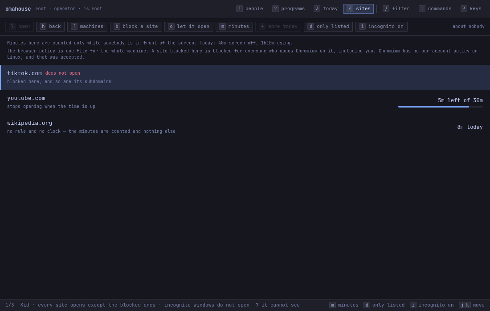
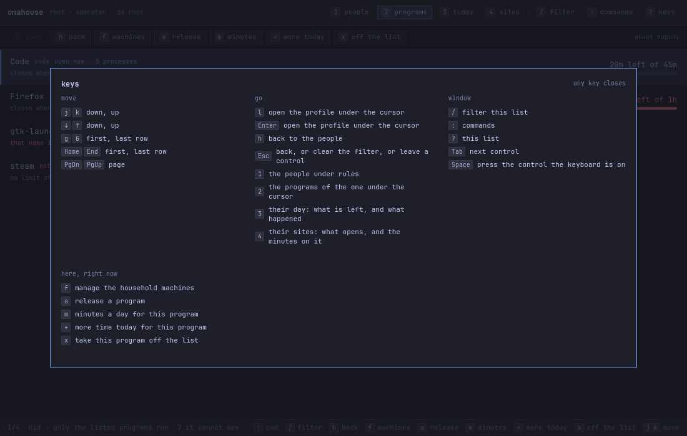

# omahouse

House rules for the accounts on an Omarchy machine: which programs each profile
may open, and for how long. The model is a lan house counter — an operator hands
over time, the machine counts it, warns before it runs out, and ends the session
when the credit does.




A household can share one daily allowance across computers using
[exclusive portions and an Omakure Battery schedule](docs/how-to-schedule-household.md).
The operator's window shows each machine with **f**. Omakure runs automation;
omahouse owns the credit and local enforcement. One-machine use needs no
scheduler, and Omastore remains an independent application.

## Install

Not published as an Omarchy default yet. From a checkout:

```bash
mise run deps      # Qt 6 + qmake
mise run build     # build/bin/omahouse and build/bin/omahouse-studio
mise run studio    # open the window
```

`packaging/` holds the unit, the polkit policy and its rule, the desktop entry
and the icon.
The Arch recipe lives in the sibling `omarchy-pkgs` repository. Released under
the MIT license. **A checkout is not an installation** — no PAM line, no
service, and no browser meter;
[how to install it, and how to take it off again](docs/how-to-install-and-remove.md)
is the difference in full.

## Start here

Every verb takes the **name of an existing account on this machine** as its
first argument. `kid` below is a placeholder: put the login name of the account
you want to put under rules, as `id` or `ls /home` would spell it.

```bash
sudo omahouse profile add kid --name "Kid"     # `kid` is the account name
omahouse status                                # the ids of what is open
sudo omahouse allow kid chromium --limit 45m
sudo omahouse limit kid --session 2h
sudo omahouse profile default kid --deny       # only what is allowed runs
sudo omahouse profile enforce kid --on         # after a day of the report

sudo omahouse web block kid youtube.com        # and which sites open
sudo omahouse web incognito kid --deny

omahouse report kid
sudo omahouse grant kid --session 10m          # with the game still open
```

A new profile is born **observing and allowing everything**: it counts and
reports and closes nothing, which buys a day of evidence before the teeth go on.
An account in `wheel` is refused a profile, because an administrator does not
fiscalise themselves by accident.

**The web rules hold for the whole machine.** Chromium has no per-account policy
on Linux, so `omahouse web` writes one managed policy composed from every
profile at once — a site blocked for the kid is blocked for you too, and
profiles that disagree compose to the most restrictive with no precedence
between them. That cost was weighed and taken;
[`docs/design.md` §11](docs/design.md) says why, and the CLI says it once when
you write the rule. Taking the last rule back, or removing the package, takes
the file off the machine.

**Time per site is counted, and a site can have a budget.** A Chromium extension
reports the site in the front tab, and the daemon bills it only while the screen
says somebody is really there — a browser answers "active" with the monitor
physically off, which is measured. It shows up in `omahouse status` and
`omahouse report` beside the budgets.

**The extension arrives with the package and leaves with it.** Installing
omahouse signs it into a `.crx` with a key made on your machine, and forces it
into Chromium; there is nothing to download, no store account, and no signing key
anybody has to keep, because the one that signs yours cannot sign anybody else's.
`pacman -R` takes the extension, the policy, the key and the native host back off
— a machine with no omahouse on it is never left with an extension nobody can
uninstall. The cost of having no key to keep is that reinstalling makes a new
one, so the browser sees a new extension; it holds no state, so nothing is lost.

`omahouse limit kid --site youtube.com=30m` gives that number teeth, and it is
the same noun as `--budget` with a domain where a scope id would be: the same
warning marks, the same grace, the same grant. When it runs out the domain goes
into the browser's blocklist — and it comes back at the turn of the day, or the
moment you hand over ten more minutes, with nothing on the machine having to
remember to let it back through.
[`docs/design.md` §5.2 and §5.3](docs/design.md) have the whole of it.

Reading needs no privilege — the fiscalised person runs `omahouse status` and
sees what is left of their own day. Writing needs root, and the window gets there
through `pkexec`. `omahouse watch` is the loop that counts, warns and acts;
`packaging/omahouse.service` runs it.

**Each of those lines has a page.** [The documentation](docs/README.md) is one
task at a time — [put an account under
rules](docs/how-to-put-an-account-under-rules.md), [say which programs may
run](docs/how-to-release-programs.md), [put a clock on the
day](docs/how-to-limit-the-time.md), [stop a site
opening](docs/how-to-block-sites.md), [give a site so many minutes a
day](docs/how-to-limit-time-on-a-site.md), [hand over more
time](docs/how-to-hand-over-more-time.md), [read the
day](docs/how-to-read-the-day.md), [link another
computer](docs/how-to-link-another-computer.md), [install it and take it off
again](docs/how-to-install-and-remove.md) — and every verb in full is in
[the command line](docs/cli.md).

## The window

`omahouse-studio` is the same model with a Qt Quick front on it. It reads by
linking the libraries directly and writes by running `pkexec omahouse <verb>`, so
the privileged half is the CLI, with the same refusals. **It is never root.**

Two faces, and nobody picks one on screen. Whoever is in `wheel` gets the
operator's: the people under rules, the programs released to each of them, the
day's balance live, the sites that open and the minutes on them, and the chips
to change all four. Everybody else gets the subject's, which is the same window
with nothing to press.

- `j` / `k`, `↓` / `↑` — move the cursor
- `g` / `G`, `Home` / `End` — first, last row
- `l` / `Enter` — open the profile under the cursor
- `h` / `Esc` — back, or clear the filter, or leave a control
- `1` / `2` / `3` / `4` — the people, their programs, their day, their sites
- `/` — filter · `:` — commands · `?` — the key map
- `Tab` — next control · `Space` — press the one the keyboard is on
- `n` — put an account under rules · `e` — close programs, or only watch
- `d` — only the listed run, or everything but the listed
- `a` — release a program · `m` — minutes a day · `+` — more time today
- `x` — take a program off the list, or an account off the books
- on the sites view: `b` — stop a site opening · `o` — let it open again ·
  `m` — minutes a day on it · `d` — only the listed sites · `i` — incognito



Every screen the window draws is in
[the walk through it](docs/screens.md), in the order somebody meets them.

## What it does not do

**It is not a security boundary.** A program started from inside a terminal
inherits the terminal's scope, so a profile with a terminal on its allowlist is a
profile that allows everything — and all of it counts as terminal time. Do not
release a terminal in a profile that is meant to hold.

The force of a rule is a property of who the operator is, not of the engine. A
profile administered by somebody else holds for real; one somebody imposes on
themselves they undo whenever they like. What the model does hold, because none
of it depends on the goodwill of the session, is the clock, the `loginctl`
logout, the counting and the daemon.

## What is broken

A sample. None of them has a fix here yet, and
[what does not work yet](docs/what-does-not-work.md) is the whole list — six of
them, each with what to do in the meantime.

- The idle lock takes the screen, and the last warnings go out behind it.
- When a session runs out, SDDM stops and the screen stays black until somebody
  brings it back.
- A CLI refusal loses its reason on the way to the studio: only the last line
  printed reaches the status bar.
- A scope nothing can name has no screen in the studio, though the CLI reports
  it.

## Build

```bash
mise run test        # unit tests and the CLI end to end
mise run lint        # the QML, with every warning fatal
mise run studio:test # the window, by keyboard and by mouse, with no screen
mise run usage:gen   # docs/cli.md, from omahouse.usage.kdl
mise run shots       # docs/img, from the studio itself, offscreen
mise run verify      # the local gate: all of the above
mise run hooks:install
mise run test:vm     # the teeth, in the VM — never on this machine
```

Shadow build only — qmake refuses to configure inside the source tree.
[How it is built](docs/design.md) is the model, the measurements that shaped it,
and what the gate refuses.

## Requirements

- Qt 6: `qt6-base`, and `qt6-declarative` for the window and its linter
- `polkit` for `pkexec`, which is how the window writes
- [mise](https://mise.jdx.dev/) for the tasks above, and for the pinned `usage`
  that generates `docs/cli.md`

`docs/img` is regenerated from the studio itself with `mise run shots`.
