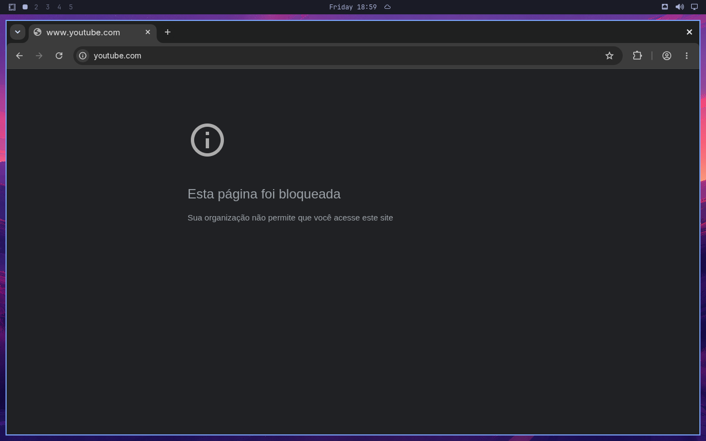
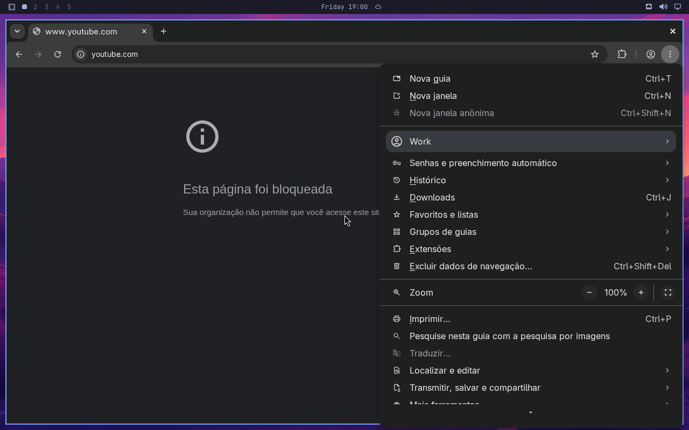
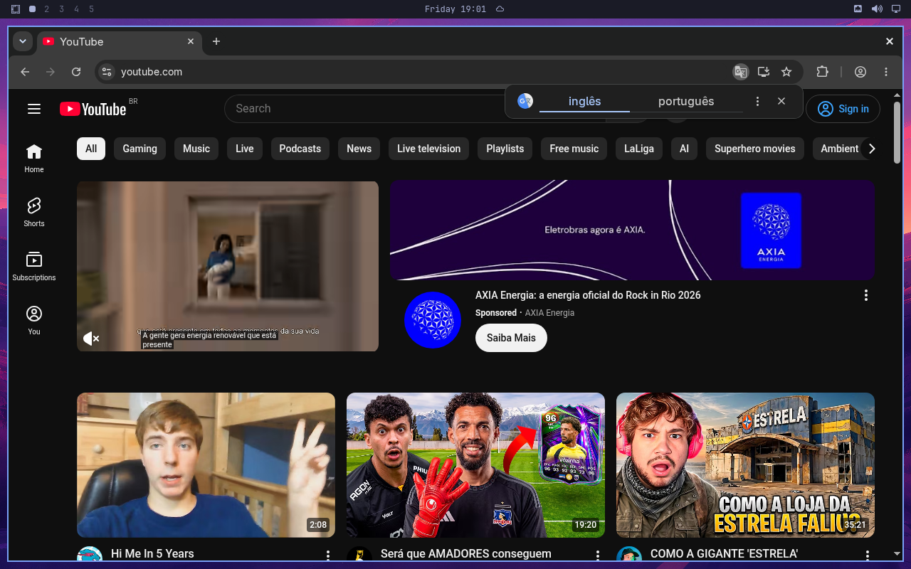

# How to stop a site opening

**The question:** this site should not open in the browser on this machine. How
do I say that, how do I take it back, and what does it cost?

This page is enough on its own. Minutes a day on a site — *thirty minutes of
YouTube* rather than *no YouTube* — is
[a page of its own](how-to-limit-time-on-a-site.md).

---

## Before you start

- **A profile exists for the account.**
  [How to put an account under rules](how-to-put-an-account-under-rules.md).
- **The browser is Chromium.** This is written through Chromium's own managed
  policy directory. Firefox gets nothing from this page.
- `kid` is a placeholder for the account's login name. Writing needs root.

**Read this before you write the first rule.** The browser policy is **one file
for the whole machine**. Chromium has no per-account policy on Linux — the
policy directory is a compile-time constant in the browser — so blocking
YouTube for the kid blocks it for you as well, in the same browser family, on
the same machine. omahouse says so every time it writes:

```
omahouse: the browser policy is one file for the whole machine. A site blocked here is
          blocked for everyone who opens Chromium on it, including you. Chromium has no
          per-account policy on Linux (docs/design.md §3.1), and that was accepted.
```

That cost was weighed and taken rather than worked around.
[`design.md` §11](design.md) says why, and says what the way out would be if the
household wants one: the kid on Chromium and the operator on a different
browser.

---

## 1. Block it

```bash
sudo omahouse web block kid youtube.com
```

```
kid: youtube.com is blocked, and so are its subdomains.
```

**A bare domain covers its subdomains**, so `youtube.com` also stops
`www.youtube.com` and `m.youtube.com`. In the child's session it looks like
this:



*(The pictures on this page are from one run on a live Omarchy, where the
account under rules was called `kid`.)*

**A whole address is refused rather than quietly turned into a rule about its
host:**

```bash
sudo omahouse web block kid https://youtube.com/feed
```

```
web block: 'https://youtube.com/feed' is not a domain. Write the site's name on its own, like youtube.com,
           and not a whole address. A bare domain covers its subdomains too.
```

A rule that is not quite the one that was typed is a rule nobody finds out about
until the day it does not fire.

## 2. Take it back

```bash
sudo omahouse web allow kid youtube.com
```

```
kid: youtube.com is allowed through what is blocked.
```

**Taking back the last block on the machine removes the policy file** rather
than leaving an empty one. There is nothing to clean up afterwards, and no
browser left saying *managed by your organisation* over a document that says
nothing.

An `allow` on its own does nothing, and omahouse says so instead of letting the
line read as a rule that is working. The allowed list is an exception carved out
of the blocked list:

```
kid: wikipedia.org is on the allowed list — which blocks nothing on its own, because nothing is blocked yet.
```

## 3. Or turn it around: only the listed sites

The mirror of *only the listed programs run*, for the web:

```bash
sudo omahouse web kid --only-listed
sudo omahouse web allow kid wikipedia.org
sudo omahouse web allow kid scratch.mit.edu
```

```
kid: only the listed sites open. 0 sites on the list.
kid: wikipedia.org is allowed through what is blocked.
kid: scratch.mit.edu is allowed through what is blocked.
```

and back again:

```bash
sudo omahouse web kid --all-but-listed
```

```
kid: every site opens except the blocked ones. 3 rules.
```

Expect an allowlist to break pages: one ordinary page pulls from ten to twenty
domains, and the breakage looks like the network being broken rather than like
the rules working. It is the right shape for a machine meant to reach four
addresses and nothing else.

## 4. Incognito

```bash
sudo omahouse web incognito kid --deny
```

```
kid: incognito windows do not open — for every account on this machine.
```

Chromium's own menu is where it shows:



```bash
sudo omahouse web incognito kid --allow
```

```
kid: incognito windows open. They hide which site, not the time: the session budget counts them either way.
```

**Allowing it is not a hole in the clock.** An incognito window is the same
browser in the same scope under the same profile, so the session budget and the
browser's own budget go on counting exactly as they did. What it hides is
*which site*, not the time. `--allow` also does not write a `0` into the policy:
it asks the browser for nothing at all, because omahouse being *more* permissive
than it was asked to be is the one direction it never takes by itself.

## 5. Read it back

```bash
omahouse status kid
```

```
SITES
  only the listed sites open
  incognito: does not open
VERDICT  SITE
block    youtube.com
allow    wikipedia.org
  /etc/chromium/policies/managed/omahouse.json, from every profile at once:
      blocked  *, youtube.com
      allowed  wikipedia.org
      incognito does not open
```

The file itself is short, and it is composed from every profile at once:

```json
{
    "IncognitoModeAvailability": 1,
    "URLAllowlist": [
        "wikipedia.org"
    ],
    "URLBlocklist": [
        "*",
        "youtube.com"
    ]
}
```

It goes under its own name beside whatever else is in that directory, because
Chromium merges every file it finds there and Omarchy's own
`browser-policy.sh` already owns `policies.json`.

---

## In the window

Before adding a rule or setting a limit, choose the profile in **Who is this
for?** Click the profile or filter its name and press Enter. This choice is
required even with one profile; Escape cancels. The following form names the
chosen account, and an automatic list refresh cannot change the recipient.

The **sites** view is `4`, or the *sites* chip:


- `b` stops a site opening, `o` lets it open again
- `d` switches between *only the listed* and *everything but the blocked*
- `i` is incognito
- `m` and `+` are about minutes, which is
  [the other page](how-to-limit-time-on-a-site.md)

`b` asks for a domain and refuses an address, with the CLI's own words:


On a profile with nothing said about sites, the view still carries the two lines
above the list — somebody about to block their first site should read what a
browser policy reaches *before* pressing `b`, not after:


---

## What can go wrong

**Another profile disagrees.** There is one file and no precedence between
profiles, so **the most restrictive of them is what the machine does**: a site
one profile blocks is blocked for all of them, and one profile's `--only-listed`
closes the door for everybody. The verb names the profile that overruled you
rather than letting you find out from the browser:

```
omahouse: pedro disagrees about youtube.com, and the most restrictive of the two is what the machine
          does — there is one policy file, and no precedence between profiles.
```

A precedence was considered and refused: it would mean a rule an operator wrote,
and can still read back in `profile show`, silently not happening. Being more
restrictive than one profile asked for is visible the moment somebody opens the
site.

**A domain that is blocked is never also allowlisted.** Chromium gives the
allowlist the tie, so a domain in both lists is a domain that opens — which
would turn *the most restrictive wins* into its exact opposite in the one case
the rule exists for.

**The browser explains nothing, and omahouse learns nothing.** A blocked site
shows Chromium's own page, which says an administrator blocked it and nothing
about who or why. There is no message from the operator to put on it, and there
is **no count of how many times a site was tried**: a managed policy blocks
inside the browser and reports nothing out, so omahouse never learns the attempt
happened at all.

**A second browser is a door with no lock on it.** Nothing in the browser stops
somebody opening a different one, and nothing in this page reaches Firefox. What
stops them is the app allowlist, and the rule is short: release Chromium and no
other browser to an account these rules are meant to hold. It has the same hole
the allowlist always has —
[do not release a terminal in a profile that is meant to hold](how-to-release-programs.md).

---

## And when omahouse goes

`pacman -R omahouse` takes the policy file off the machine with everything else
it wrote, and every site opens again:



The whole of that is
[how to install it and take it off again](how-to-install-and-remove.md).

---

## Next

- [Minutes a day on a site](how-to-limit-time-on-a-site.md) — and why they are
  counted only while somebody is in front of the screen.
- [Reading the day](how-to-read-the-day.md) — where the browsing went.
