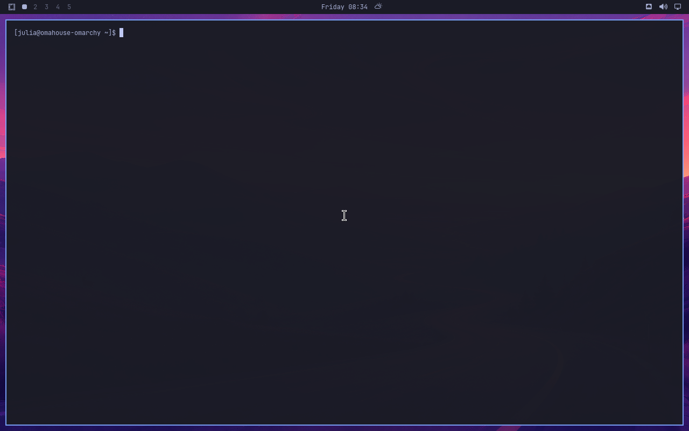
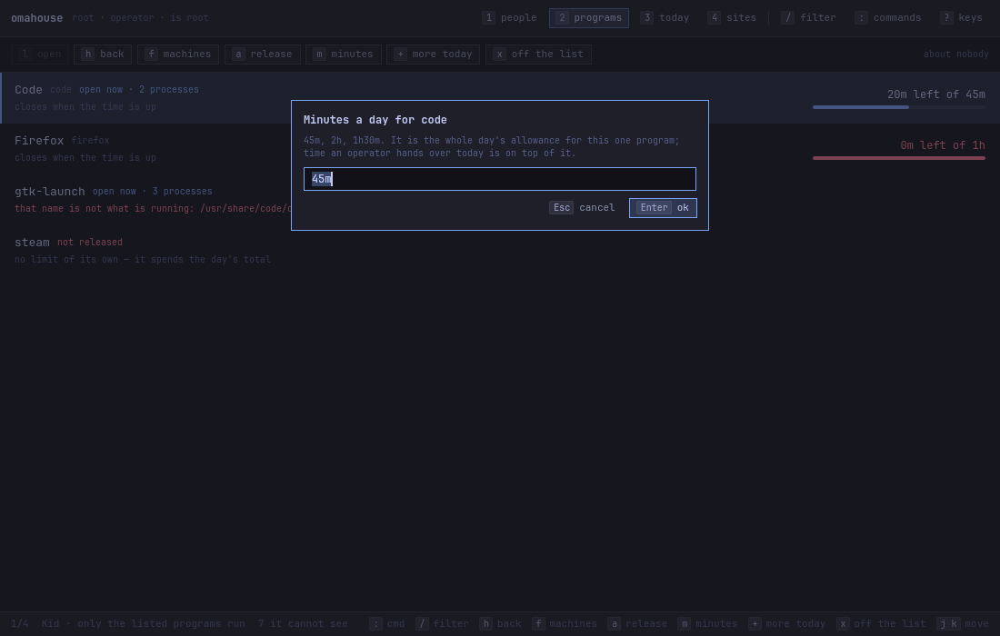
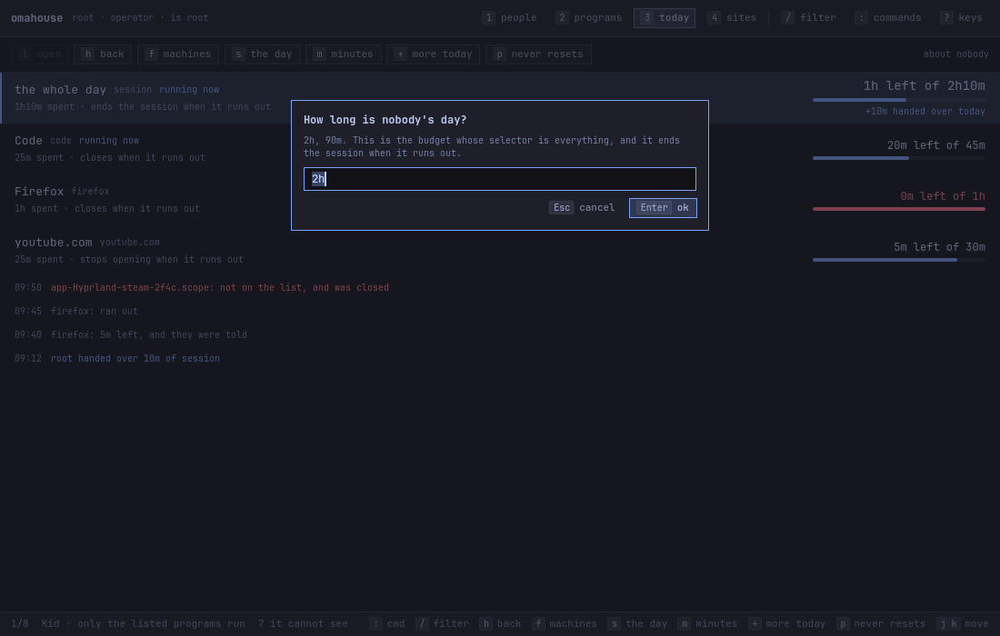
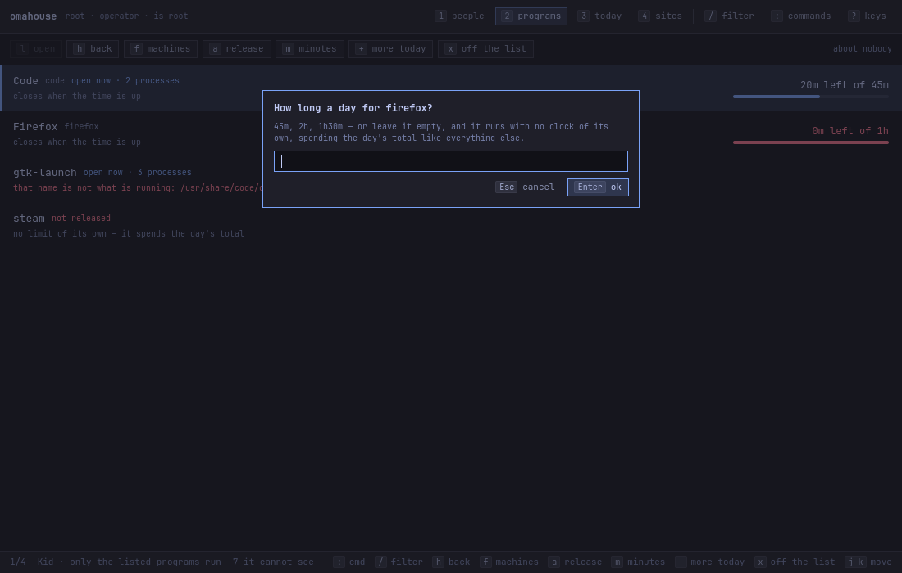
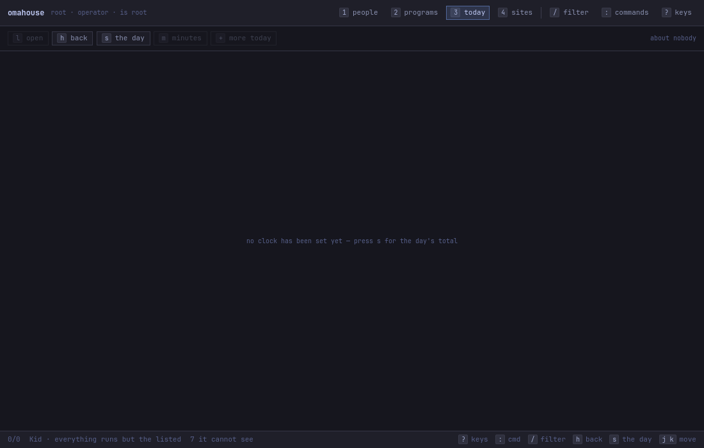

# How to put a clock on the day

**The question:** two hours of machine a day, and no more than forty-five
minutes of that in the browser. How do I write those numbers, and how do I make
them bite?

This page is enough on its own. It ends with a profile that warns, closes the
program whose time has gone, and ends the session whose day has.

---

## Before you start

- **A profile exists for the account.**
  [How to put an account under rules](how-to-put-an-account-under-rules.md).
- **You know what the programs are called.** An app is named by the id of its
  scope, which `omahouse status` lists —
  [how to say which programs may run](how-to-release-programs.md).
- `kid` is a placeholder for the account's login name. Writing needs root.

**A length of time is `45m`, `2h`, `1h30m`, or a bare number of minutes.**
Anything else is refused rather than turned into minutes:

```
limit: '2hours' is not a length of time: there is no number in front of 'ours'
```

`--limit 2h` read as two minutes would be a session that ends at nine in the
morning, and refusing costs one retyped word.

---

## 1. The day

```bash
sudo omahouse limit kid --session 2h
```

```
kid: session 2h a day, and it logs out when the time is out.
```

**The session is the budget whose selector is `*`.** There is no separate
concept of user time: it is an ordinary budget that matches every app. What it
does *not* match is the session's own furniture — `udiskie` and
`omarchy-hyprland-monitor-watch`, which Omarchy starts for itself — so the clock
begins at the first program somebody opened and not at login. If this machine
starts something else of its own, name it in `/etc/omahouse/furniture`, one per
line.

## 2. One program

```bash
sudo omahouse limit kid --budget chromium=45m
```

```
kid: chromium 45m a day, and it closes when the time is out.
```

The id is the app's scope id, the same one a rule uses. Writing the rule and the
budget in one go is what `allow --limit` is for:

```bash
sudo omahouse allow kid chromium --limit 45m
```

```
kid: chromium allowed, 45m a day, and it closes when the time is out.
```

Two things worth knowing:

- **A program released with no limit of its own** runs and spends only the day's
  total. That is a legitimate thing to want.
- **A budget can be written for a program no rule names.** That is a program
  somebody wants a number for at the end of the day, and it is allowed.
- **Chromium turns up as two ids**, so name both of them in one command and
  they share one clock:

  ```bash
  sudo omahouse allow kid chromium org.chromium.Chromium --limit 45m
  ```

  ```
  kid: chromium and org.chromium.Chromium allowed, 45m a day between them, and they close when the time is out.
  ```

  *Between them* is the part to read. Two commands with `--limit 45m` in each
  would be two clocks of 45 minutes that happen to agree, and forgetting one
  leaves half the browser with no limit at all.

A budget that is already there gets the new number and keeps everything else:
what a budget does when it runs out is a decision somebody made once, and a new
limit is not a reason to take it back.

## 3. Watch one cycle with no consequences at all

```bash
omahouse watch --once --dry-run
```

It reads the tree, debits the tick, prints the whole of the accounting —
including what it would have closed and who it would have refused at the next
login — and then writes no ledger, sends no notification, signals nothing and
ends nobody's session. It needs no privilege of any kind.

This is also the safe way to point omahouse at a machine nobody meant to
fiscalise.

## 4. Put the teeth in

```bash
sudo omahouse profile enforce kid --on
```

```
kid: enforcing — budgets now close and log out.
```

`--off` is the observing mode a profile is born in — it counts and reports and
closes nothing — and it is where to go back to when something is biting too hard
and you do not yet know what:

```
kid: observing — it counts and reports, and closes nothing.
```

## 5. Read it back

```bash
omahouse profile show kid
```

```
BUDGETS
BUDGET    APP                              A DAY  WHEN OUT
chromium  chromium, org.chromium.Chromium     3m  closes
session   *                               2h00m  logs out
```

One row and two names: the `APP` column is every id the budget is about, and the
number is what they have between them.

`omahouse status kid` is the same numbers live, with what has been spent and
what is left — [reading the day](how-to-read-the-day.md).

---

## What the person under rules sees

**There is no indicator on the bar.** Omarchy's `quickshell` stays as it came;
omahouse puts nothing in it. What arrives is notifications, and what can be
looked up is `omahouse status` or the window.

**The warning.** The default marks are 10, 5 and 1 minute left. The notification
names the budget and the clock time the cut happens at:


*(These pictures are from one run on a live Omarchy, where the account under
rules was called `julia`. The commands here say `kid`; it is the same
placeholder.)*

**The grace window.** Once the budget is spent, twenty seconds open between
*time is up* and the closing, and it is said once per budget. The run these
pictures come from predates one budget holding both of Chromium's ids and had
two of them, which is what two notifications look like:


Written the way §2 writes it — both ids in one command — the same moment is one
notification, and both halves of the browser close together.

**The program closes and the session stays.** Twenty seconds later the browser
is gone, the terminal is still open, the bar is still there:



This is the whole point of the design: closing is `SIGTERM` into the app's own
scope and then that scope's `cgroup.kill`, and `session.slice` is never touched.

**The session's own clock runs even with nothing happening:**


**The end of the session, and the refused login.** When the day is out the name
goes into `/etc/omahouse/blocked`, the stock `pam_listfile` line in
`/etc/pam.d/system-login` starts refusing, and only then is the session ended.
The right password no longer gets in — the greeter's box turns red and nothing
explains why:


The journal on the other side says `pam_listfile(sddm:account): Refused user
kid`. Nothing has to remember to take the name out again: every cycle works out
from today's ledger who should be refused right now and writes exactly that, so
the turn of the day, a grant, `enforce --off` and `profile remove` each let
somebody back in.

Two defects live in this sequence, and both were measured:
[if the screen locks on idle the last warnings go unseen](what-does-not-work.md#1-if-the-screen-locks-on-idle-the-last-warnings-go-unseen),
and
[when the session runs out the screen goes black](what-does-not-work.md#2-when-the-session-runs-out-the-screen-goes-black).
Read both before switching on `logout` on a machine nobody can reach the console
of.

---

## In the window

`m` on the **programs** view is one program's day. It opens with what is written
in the profile, not with what today's grants have made of it — folding a grant
made for one day into the rule for every day is the mistake that avoids:



`s` on the **today** view (`3`) is the whole day:



And on the picker that follows `a`, the limit can be left empty:



`e` on the **people** view is the teeth, in and out. On a profile with no clock
at all, the today view says which key would fix it:



---

## What can go wrong

**A short budget has fewer warnings, and that is on purpose.** The marks are 10,
5 and 1 minute left, and a mark the budget was never above is not a mark: a 3
minute browser warns once, at 1 minute, rather than announcing five minutes it
never had. A budget under a minute gets no mark at all and only the grace
warning — which was always the one that mattered there.

**`warnAt` and `grace` have no verb.** They are fields in
`/etc/omahouse/profiles.json`, and editing that file by hand is the only way to
change them.

**A limit is not a prohibition and neither is a rule.** The force of a rule is a
property of who the operator is, not of the engine: a profile administered by
somebody else holds for real; one somebody imposes on themselves they undo
whenever they like. What does hold, because none of it depends on the goodwill
of the session, is the clock, the `loginctl` logout, the counting — the ledger
is written by root — and the daemon, which is `Restart=always`.

---

## Next

- [How to hand over more time](how-to-hand-over-more-time.md) — with the program
  still open.
- [Reading the day](how-to-read-the-day.md) — the balances, the events and what
  they are for.
- [Minutes a day on a site](how-to-limit-time-on-a-site.md) — the same noun with
  a domain where the scope id would be.
