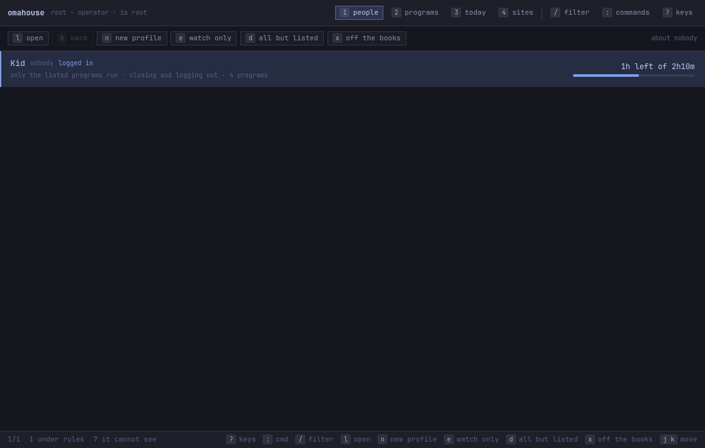

# How to put an account under rules

**The question:** somebody on this machine should have a profile — a set of house
rules that counts their time and, later, closes what runs out. How do I write
one, and how do I take it back?

This page is enough on its own. It ends with an account that is being observed
and nothing else: nothing closes, nobody is logged out, and a day of
[`omahouse report`](how-to-read-the-day.md) is the evidence you switch the teeth
on with.

---

## Before you start

- **omahouse is installed and the daemon is running.**
  [How to install it and take it off again](how-to-install-and-remove.md).
- **The account already exists on this machine.** `ls /home`, or `id kid`, is
  how it is spelled. Every verb below takes that login name as its first
  argument, and `kid` throughout this page is a placeholder for it — it is not a
  keyword.
- **You can become root.** Reading needs no privilege; writing does.

---

## 1. Write the profile

```bash
sudo omahouse profile add kid --name "Kid"
```

```
kid: profile written to /etc/omahouse/profiles.json
  observing — it counts and reports and closes nothing. Watch a day of
  `omahouse report kid`, then `omahouse profile enforce kid --on`.
  every app is allowed: `omahouse profile default kid --deny` turns the
  rules into a list of what is allowed instead.
```

`--name` is only the label the window shows. Leave it out and the window shows
the account name.

**A new profile is born with no teeth and allowing everything** — `enforce:
false`, `default: allow`. That is on purpose, and it is the same choice twice: a
profile that counts without biting buys you a day of evidence before the rules
go on, and a half-written profile that denied everything would lock somebody out
of their own machine.

## 2. Read it back

```bash
omahouse profile show kid
```

```
omahouse profile — kid (Kid)

SETTING  VALUE
enabled  yes
enforce  no — counts and reports, closes nothing
default  allow
warn at  10m, 5m, 1m left
grace    20s

No rules: every app falls to the default, allow.

No budgets: nothing is on the clock.

SITES
  kid has no web rules: every site opens, and there is no browser policy on this machine because of them.
```

`warn at` is the list of minutes-remaining marks the person is warned at, and
`grace` is the seconds between the last warning and the closing. Neither has a
verb; they are fields in `/etc/omahouse/profiles.json`, and editing that file by
hand is the only way to change them.

That is the whole profile. It has no programs and no clock yet, and both of
those are their own page:
[which programs may run](how-to-release-programs.md), and
[how long a day](how-to-limit-the-time.md).

---

## In the window

`omahouse-studio` does the same thing, and every write it makes goes out as
`pkexec omahouse …`, so polkit asks for a password and the refusals are the
CLI's own. If you are an administrator it asks for **your** password; anybody
else is asked for an administrator's, and there is no arrangement of the window
that lets the account under rules release itself.

Open it from a terminal that is allowed:

```bash
uwsm app -- omahouse.desktop
```

On the **people** view (`1`), `n` asks which account:


Then polkit, and then the row is on the list:



On a machine where nobody has been put under rules yet, the same view says so
and lights one chip:


---

## What can go wrong

**The account is in `wheel`.** This is the program's one hard refusal:

```
profile add: howl is in wheel, and an administrator does not fiscalise themselves by accident.
             Take the account out of wheel first, or write the profile for somebody else.
```

whoever is in `wheel` is the operator — the person who could undo the rule is
the person it would be imposed on. Take the account out of `wheel` first, or
write the profile for somebody else.

In the window the same refusal lands on the status bar, in red:


Only the last line the CLI printed reaches that bar, so the sentence that says
*what* was refused is dropped and what is on screen is the advice with the
verdict missing. That is a known defect —
[a refusal loses its reason on the way to the window](what-does-not-work.md#5-a-refusal-loses-its-reason-on-the-way-to-the-window)
— and running the same verb in a terminal is how to read the whole of it.

**There is no such account yet.** Not a refusal: the profile is written and the
missing account is said out loud, because a profile can be written before its
account and can outlive it. `sudo omahouse profile add kid --create-user` will
create it first with `useradd -m` and do nothing else to it.

**There is already a profile for that account.** Refused. Two sets of rules for
one account would be two rules nobody could point at; change the one that is
there.

---

## How to take it back

```bash
sudo omahouse profile remove kid
```

The profile leaves `/etc/omahouse/profiles.json` and **nothing else moves.** The
account itself is never touched — this build does not run `userdel` under any
flag — and the days already counted stay under `/var/lib/omahouse/kid/`, because
a report is evidence and it outlives the rules it was collected under.

It also takes that profile's web rules off the machine. If it was the last
profile with any, the browser policy file goes with it and every site opens
again; there is nothing left in `/etc/chromium` to find later and wonder about.

In the window, `x` on the people view. It is one of the two things that ask
first:


---

## Next

- [Which programs may run](how-to-release-programs.md) — and the trap that
  decides the shape of your list.
- [How long a day](how-to-limit-the-time.md) — the clock, and switching the
  teeth on.
- [Reading the day](how-to-read-the-day.md) — the evidence to read before you do.
