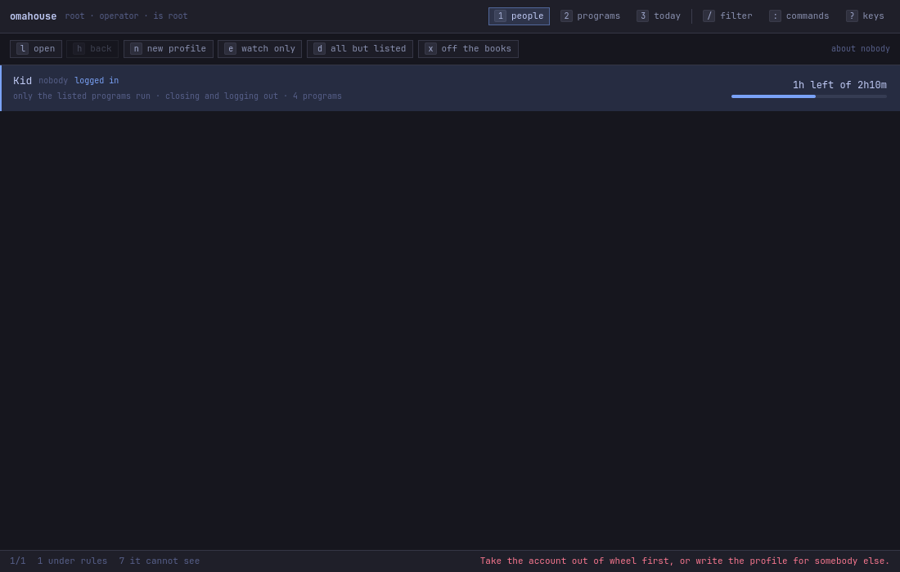
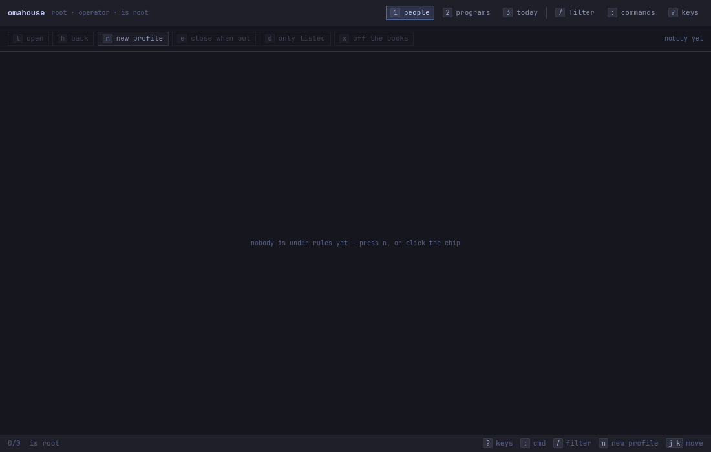
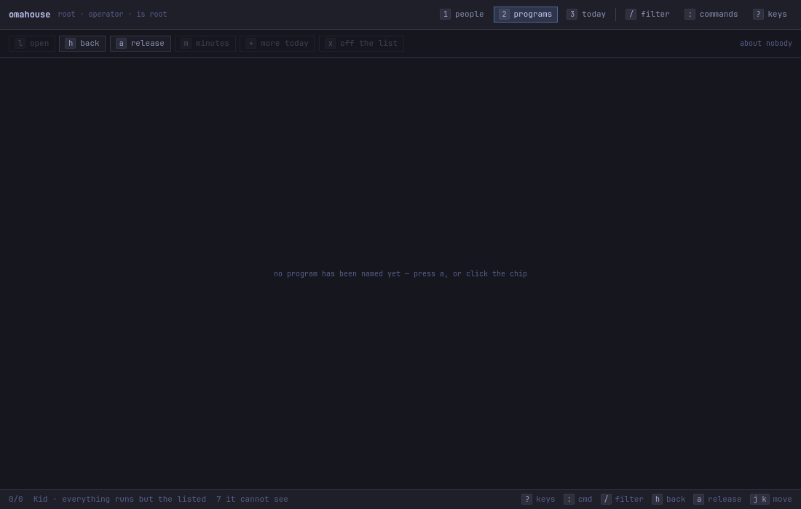
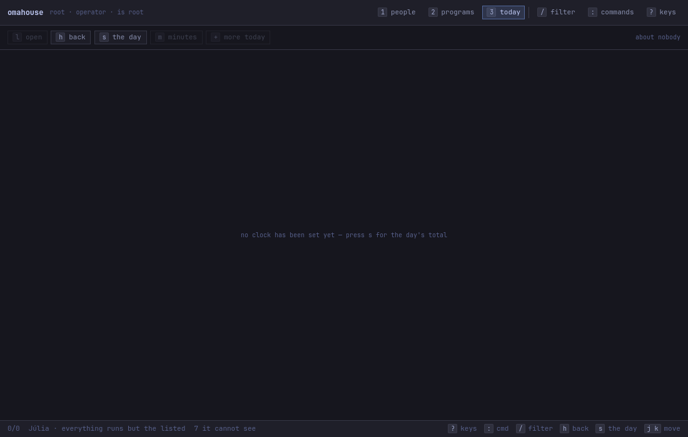
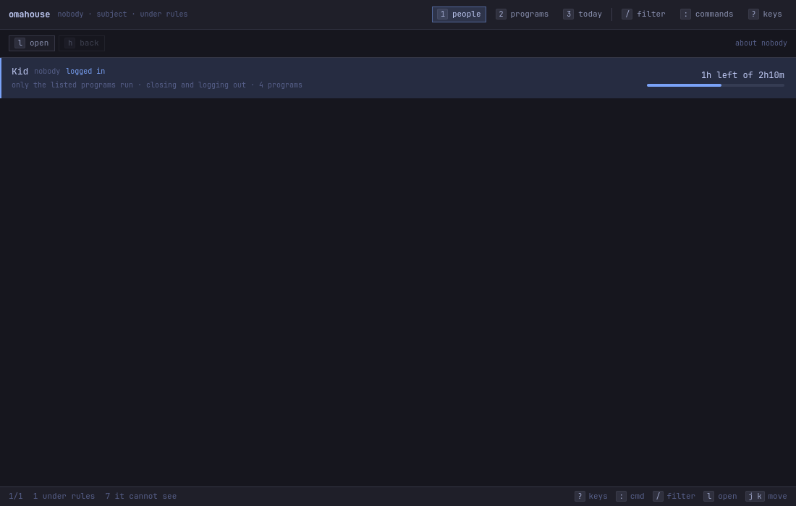
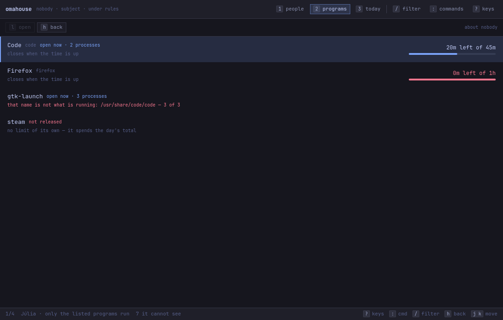
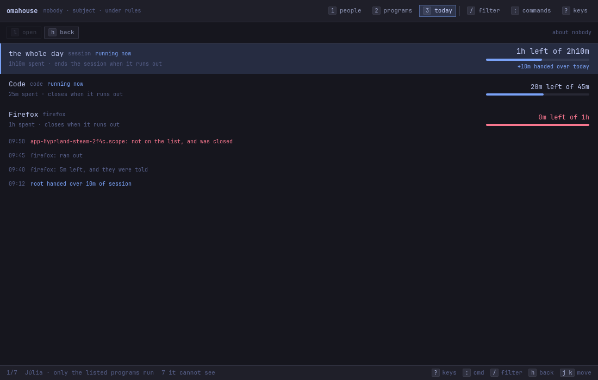
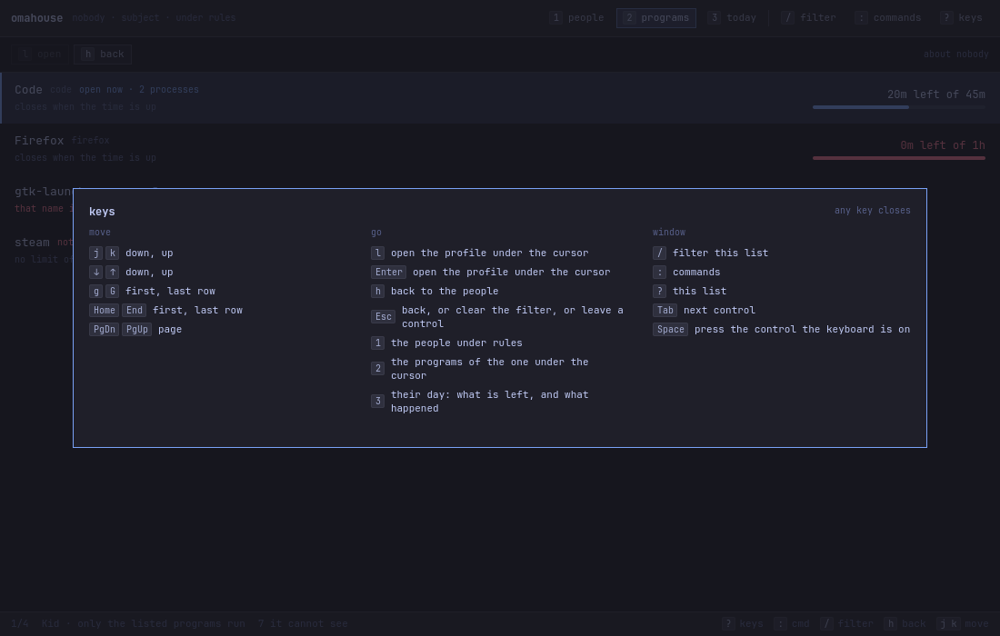
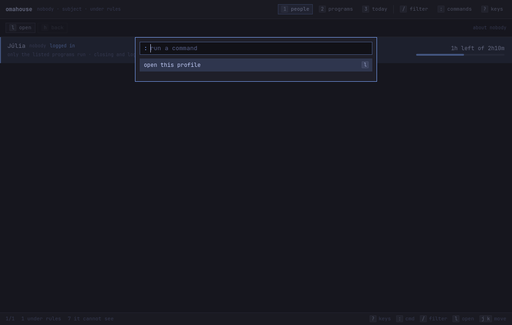
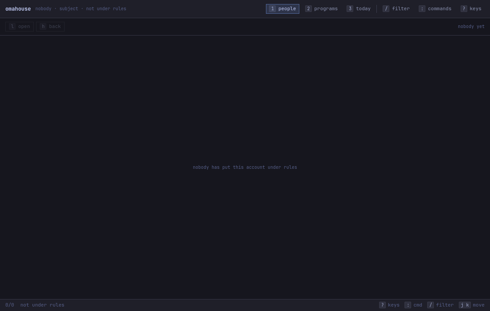

# Every screen omahouse-studio draws

An inventory, not a tour. [The guide](guide.md) teaches somebody to build a
profile and shows the screens they pass through on the way; this lists **all** of
them, including the ones a happy path never reaches, so that a change to the
window has somewhere to be checked against.

---

## How this page stays true

| what | how |
|---|---|
| the pictures under `docs/img/` | `mise run shots` — writes them from the studio itself, offscreen |
| checking they are still what it draws | `mise run shots:check`, and `mise run verify` runs it |
| the pictures under `../vm/shots/` | not regenerable: one run of one script through a live Omarchy desktop |

`mise run shots` needs no display, no session and no VM. It builds the studio's
own test binary, points both roots at a temporary tree, seeds the household
below with the shipped `omahouse` verbs, and drives the real window under real
key events with `QT_QPA_PLATFORM=offscreen`. Every frame is refused if it is a
flat rectangle, which is what an inventory of empty pictures would otherwise
quietly become.

Nothing of the machine it runs on gets in. The theme falls through to its own
defaults rather than reading omarchy's current one, the day's ledger has the
clock written into it rather than taken from `QTime::currentTime`, the caret does
not blink, and the header names `root` or `nobody` rather than whoever typed the
command — `$OMAHOUSE_AS` moves what the window *reads* and never what may be
*written*. One thing is not pinned and cannot be: which face `monospace`
resolves to is fontconfig's answer, so a machine with a different monospace font
finds the whole set stale at once.

### The example household

Everything below is about one profile, written by the real verbs:

```
omahouse profile add nobody --name "Kid"
omahouse profile default nobody --deny        # only the listed programs run
omahouse profile enforce nobody --on          # closing and logging out
omahouse limit nobody --session 2h
omahouse allow nobody code --limit 45m
omahouse allow nobody firefox --limit 1h
omahouse allow nobody gtk-launch              # released with no clock of its own
omahouse deny nobody steam
```

with a day already partly spent (`1h10m` of the session, `25m` of Code, all of
Firefox's hour), one grant of `10m` handed over at 09:12, and a session made of
four cgroups: Code with two processes, a `gtk-launch` scope with three processes
that are all really VS Code, a `tmux-spawn` scope nothing can name, and the
compositor's own unit with seven.

`nobody` because it is a real account on every Linux and is in `wheel` on none —
so `profile add` accepts it, and no row carries "no such account on this
machine" across every frame.

---

# 1. Generated — `mise run shots`

## 1.1 The operator face

Whoever is in `wheel`. The header says so and nobody chooses it.

### `1` · the people

The list of accounts under rules. `1`, or the **people** chip.


The row carries the display name, the account name, whether they are logged in,
what the policy does to programs, whether the rules have teeth, how many
programs are named, and the day's balance as both a sentence and a meter. The
status bar counts the list, names the household, and says how many processes
this window cannot account for — `7 it cannot see`, which is never zero on a
live session and is said plainly rather than as an alarm.

### `2` · the programs

What that account may open, and for how long. `2`, or the **programs** chip, or
`l` / `Enter` on a person.


Four rows and four different things: a program running under its limit, one that
has run out (the balance and the bar in the urgent colour), one whose scope name
is a launcher shim with something else inside it — said in red, because
releasing `gtk-launch` is releasing whatever it launches next — and one that is
named and refused.

### `3` · today

The balances and the day's log in one column. `3`, or the **today** chip.


The session budget first, because it is what somebody opened this window for,
then a budget per program, then the day's log newest first: a denial in the
urgent colour, a budget running out, a warning that was delivered, and the grant
in the accent colour. The whole thing is one list, so `j` and `k` walk it.

### `?` · the keys

Every key this window answers, on the window. Any key closes it.


The bottom group is generated from the same table the chips are drawn from, so
it changes with the view and cannot promise a key nothing answers.

### `:` · the commands

Everything the window can do right now, by name, with its key beside it. `:`, or
the **commands** chip.


Only what is usable is listed: a menu of things that would refuse is a menu you
stop reading.

### `/` · the filter

Narrows the list. `/`, or the **filter** chip; `Enter` keeps it, `Esc` clears it.


Worth knowing before reading this picture: the needle is `o`, and it has to be
something that also matches the profile's own name. One filter is applied to all
three lists at once, so a needle that misses the person on the people list
empties the people list — and then the programs view has nobody to be about and
draws *nobody is under rules yet* over a household that is right there. The key
sheet says `/ filter this list`. This is not yet that — it is §6.7 of the
guide.

### The questions

Each is a sheet over the window with the same two chips, `Esc cancel` and
`Enter ok`, and the keys printed on their faces.

**A new profile** — `n` on the people view, or the **new profile** chip.


**Which program to release** — `a` on the programs view, or the **release** chip.


What is open right now comes first, because a running scope is the ground truth,
and the `.desktop` entries follow. The line under each id is what is really in
there, in the urgent colour when it disagrees with the name — this window will
not let a rule about a shim be written without showing what the shim holds.

**How long a day for it** — follows the picker, on `Enter` or a click on a row.


**Minutes a day** — `m` on a program or a budget, or the **minutes** chip.


It opens with what is written in the profile, not with what today's grants have
made of it: folding a grant made for one day into the rule for every day is the
mistake this avoids.

**More time today** — `+` on a program or a budget, or the **more today** chip.


The `+` on the left is drawn by the field and is not in it. It goes into today's
ledger, expires with it, and adds to the limit rather than replacing it.

**The day's total** — `s` on the today view, or the **the day** chip.


**Off the books** — `x` on the people view. One of the two things that asks.


**Off the list** — `x` on a released program. The other one.


Nothing else asks. A confirmation on an action that is its own undo is a
keystroke charged for nothing.

### When it is not the happy path

**A refusal.** `n`, then an account that is in `wheel`. The CLI refuses — it is
the program's one hard refusal — and the window says so on the status bar, in
the urgent colour, rather than doing nothing.



Only the last line of what the CLI printed reaches the bar. The sentence that
says *what* was refused and why — `profile add: root is root, and an
administrator does not fiscalise themselves by accident.` — is above it, and is
dropped. What is on screen is the advice with the verdict missing — §6.8 of
the guide.

**Nobody under rules yet.** A machine where the program has just been installed.



**A profile with no programs named.** `2` on an account that has just been
created.



**A profile with no clock.** `3` on the same account.



Three different sentences and not one, each naming the key that would fix it.

### What has no screen

Two things belong on this list by their absence, because somebody looking for
them here should find out that there is nothing to find.

**polkit.** Every write this window makes goes out as `pkexec omahouse`, and on a
real machine that raises a password dialogue and can come back with *cancelled at
the password prompt* or *polkit would not authorise it* on the status bar. None
of that can be generated: the fixture writes into a temporary tree, where
`Paths::configDirIsTheSystems` is false and nothing is elevated, and a generator
that raised a real polkit prompt would be a documentation task asking a human for
a password. The dialogue is `31` and `37` in §2, and the sentence that follows it
is `32`.

**A scope nothing can name.** `omahouse status` reports these prominently — a
`tmux-spawn-<uuid>.scope` with twenty processes in it is somebody at the
keyboard, and [`design.md`](design.md) §5 asks for what cannot be accounted for
to be said out loud. The example household has one, with four processes in it. It
appears nowhere in this window: `House` computes `unnamedProcesses` for every
profile and no view reads it. What the status bar does say is the other number,
`7 it cannot see`, which is the processes in `session.slice` — a different fact,
and not this one. It is §6.9 of the guide.

## 1.2 The subject face

Everybody who is not in `wheel`: the same window, the same rows, the same keys
to walk them, and nothing to press. It is not a second window — a read-only
window built out of a second set of components would be a second window to keep
in step.

### `1` · the people



One row, their own. The rest of the household is not shown here — the file is
world readable, but a window is not a reason to publish it.

### `2` · the programs



The same information, including the red shim warning. What is missing is every
way to change it.

### `3` · today



This is the screen [`design.md`](design.md) §8 is about: the fiscalised account
is shown what is left, and the decisions are somebody else's.

### `?` · the keys



Three groups instead of four. There is no fourth because there is nothing in it.

### `:` · the commands



### Nobody has put this account under rules



A different sentence from the operator's empty list, because it is a different
fact and there is nothing this reader could press about it.

---

# 2. From the live system — `vm/shots/`

One run through a VM with Omarchy installed on it, on **2026-09-04, between
08:29 and 08:54**, driven by `ydotool` and captured by `virsh screenshot` and by
`grim`. Forty-three frames; [the guide](guide.md) is where they are read in
order, with what each one was.

Four more were added on the same machine on **2026-09-04, between 18:58 and
19:01**, for the web rules of `design.md` §11 — the whole cycle of installing
the package, blocking a site, and removing the package again. `44` and `45` are
with the rule in force, `46` and `47` are the same two screens after
`pacman -Rns omahouse`, which is the pair that proves removal is complete.

The account under rules on that machine was called `julia`, and the name is
drawn into the pictures. Everywhere else in this repository the example account
is `kid`, which stands for whatever the account is called on the machine you are
reading this on.

These are not regenerable, and they are not in the generator on purpose. Every
screen below belongs to something other than this window — a display manager, a
notification daemon, a lock screen, polkit, a compositor — and a generator that
faked one would be publishing a picture of a thing that had not happened.

| the screen | who draws it | in `vm/shots/` |
|---|---|---|
| the greeter | SDDM | `01`, `02`, `17`, `26` |
| the greeter refusing a blocked account — the box goes red and says nothing | SDDM and `pam_listfile` | `18` |
| a warning, a last word before closing, a denial | the notification daemon | `08`, `10`, `11`, `13`, `14` |
| the Omarchy application menu, and a launch that was refused | walker / the compositor | `06`, `07`, `09` |
| the lock screen the session's last warnings went out behind | `hyprlock` | `15` |
| the black screen after `loginctl terminate-user` | nothing at all | `16` |
| the polkit password dialogue over the studio | polkit's agent | `31`, `37` |
| a session standing up, a program closing under it | the compositor | `03`, `04`, `05`, `12`, `19`, `27` |
| a site refused by the managed policy, and the same site opening once the package is gone | Chromium | `44`, `46` |
| **Nova janela anônima** greyed out in Chromium's own menu, and back a minute later | Chromium | `45`, `47` |

And these are the studio itself, in a real session — the same screens as §1 with
the machine's real theme, a real `.desktop` catalogue and a real day behind
them. Worth keeping beside the generated set for exactly that reason, and worth
not mistaking for it:

| the screen | in `vm/shots/` |
|---|---|
| the three views and the key sheet, subject face, as `julia` | `20`–`24` |
| the command palette, subject face | `25` |
| the three views and the key sheet, operator face, as `howl` | `28`, `29`, `33`, `41` |
| the new-profile prompt and the refusal that followed it | `30`, `32` |
| the program picker, filtered, over a real catalogue of shims | `34`, `35` |
| the limit, the grant and the day's total, asked and answered | `36`, `38`, `39`, `40`, `42`, `43` |

Two of them are the record of a defect rather than of a screen, and both defects
are in §6 of `docs/guide.md` under the names they have there:
`20-studio-julia.png`, where a narrow window draws the header over the subtitle
and the tabs, and `39-studio-mais-tempo-hoje.png`, where the `+` that opened
**more time today** lands in the field it opened and leaves `ok` greyed out.
Neither is reachable from the generator: the first needs a window somebody has
resized, and the second is a keystroke arriving after the sheet is up, which is
a race the offscreen run does not lose.
