# The window, in the order somebody meets it

A walk through `omahouse-studio` from opening it on a machine where nobody is
under rules to running a profile day to day. **Every screen the window draws is
here**, including the ones a happy path never reaches, so that a change to the
window has somewhere to be checked against — but they are in the order of use
rather than sorted by face and by view.

The how-to pages are where the *commands* live; this page is where the *window*
does. If you are looking for a task rather than a screen, start at
[the map](README.md).

---

## How this page stays true

| what | how |
|---|---|
| the pictures under `img/` | `mise run shots` — writes them from the studio itself, offscreen |
| checking they are still what it draws | `mise run shots:check`, and `mise run verify` runs it |
| the pictures under `../vm/shots/` | not regenerable: one run of one script through a live Omarchy desktop |

`mise run shots` needs no display, no session and no VM. It builds the studio's
own test binary, points both roots at a temporary tree, seeds the household
below with the shipped `omahouse` verbs, and drives the real window under real
key events with `QT_QPA_PLATFORM=offscreen`. Every frame is refused if it is a
flat rectangle, which is what an inventory of empty pictures would otherwise
quietly become.

Nothing of the machine it runs on gets in. The theme falls through to its own
defaults rather than reading omarchy's current one, the day's ledger has the
clock written into it rather than taken from `QTime::currentTime`, the caret
does not blink, and the header names `root` or `nobody` rather than whoever
typed the command. One thing is not pinned and cannot be: which face
`monospace` resolves to is fontconfig's answer, so a machine with a different
monospace font finds the whole set stale at once.

### The household in the pictures

Everything generated below is about one profile, written by the real verbs:

```
omahouse profile add nobody --name "Kid"
omahouse profile default nobody --deny        # only the listed programs run
omahouse profile enforce nobody --on          # closing and logging out
omahouse limit nobody --session 2h
omahouse allow nobody code --limit 45m
omahouse allow nobody firefox --limit 1h
omahouse allow nobody gtk-launch              # released with no clock of its own
omahouse deny nobody steam
omahouse web block nobody tiktok.com          # a site that does not open at all
omahouse limit nobody --site youtube.com=30m  # a site with a clock on it
omahouse web incognito nobody --deny
```

with a day already partly spent (`1h10m` of the session, `25m` of Code, all of
Firefox's hour, `25m` of YouTube's half hour), one grant of `10m` handed over at
09:12, `8m` counted against `wikipedia.org` which has no rule and no clock at
all, a presence of `1h10m using` and `40m screen-off`, and a session made of
four cgroups: Code with two processes, a `gtk-launch` scope with three processes
that are all really VS Code, a `tmux-spawn` scope nothing can name, and the
compositor's own unit with seven.

`nobody` because it is a real account on every Linux and is in `wheel` on none —
so `profile add` accepts it, and no row carries *no such account on this
machine* across every frame.

---

# 1. Opening it

```bash
uwsm app -- omahouse.desktop
```

**Two faces, and nobody picks one on screen.** Whoever is in `wheel` gets the
operator's; everybody else gets the subject's, which is the same window with
nothing to press. The header says which, and why: `howl · operator · is in
wheel · writes through pkexec` against `nobody · subject · under rules · writes
through pkexec`.

It is never root. Everything it writes goes out as `pkexec omahouse <verb>`, so
the privileged half is the CLI, with the same refusals.

On a machine where the program has just been installed, this is the whole
window:

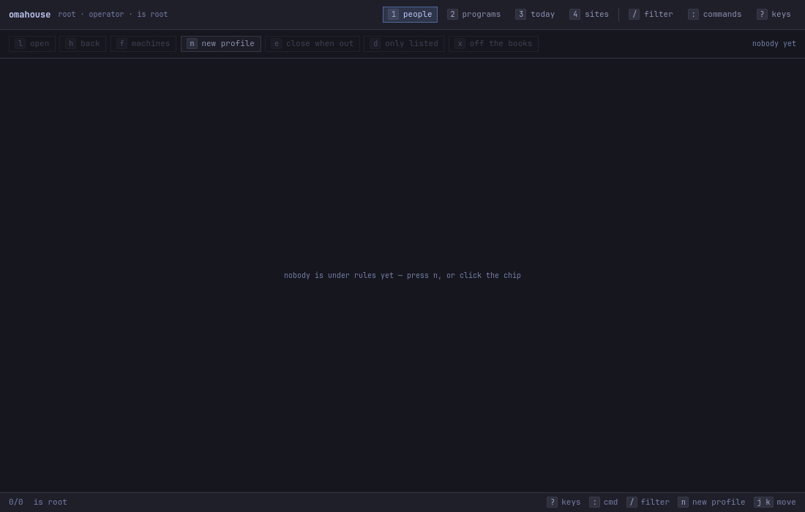

One sentence, one lit chip, and the key that would fix it. Everything else is
dim because there is nothing yet for it to be about.

# 2. Putting an account under rules

`n`, or the **new profile** chip. The question says what kind of name it wants
and what it will refuse:

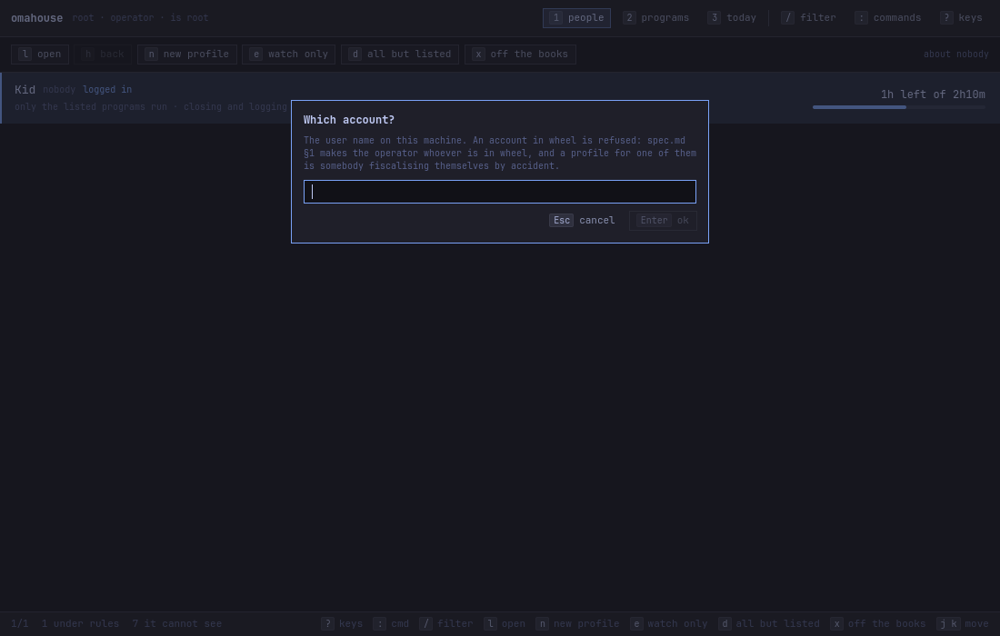

Every sheet in this window has the same two chips, `Esc cancel` and `Enter ok`,
with the keys printed on their faces. `ok` is greyed out until there is
something to press it about.

**When the answer is an account in `wheel`,** the CLI refuses — it is the
program's one hard refusal — and the window says so on the status bar, in the
urgent colour, rather than doing nothing:

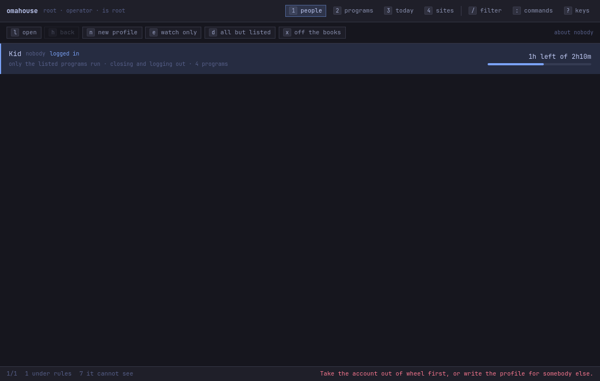

Only the last line of what the CLI printed reaches that bar. The sentence that
says *what* was refused is above it and is dropped, so what is on screen is the
advice with the verdict missing — it is
[defect 3](what-does-not-work.md#3-a-refusal-loses-its-reason-on-the-way-to-the-window).

**When it works, there is a row.** This is the view the window opens on from now
on, and `1` comes back to it from anywhere:


The row is the whole profile in one line: the display name, the account name,
whether they are logged in, what the policy does to programs, whether the rules
have teeth, how many programs are named, and the day's balance as both a
sentence and a meter. The status bar counts the list, names the household, and
says how many processes this window cannot account for — `7 it cannot see`,
which is never zero on a live session and is said plainly rather than as an
alarm.

`e` puts the teeth in and takes them out; `d` swaps *only the listed programs
run* for *everything runs but the listed*. Both are one field, and the chip
reads what pressing it would do rather than what is true now.

# 3. Saying which programs may open

`l` or `Enter` on the person, or `2`. On a profile that has just been created:

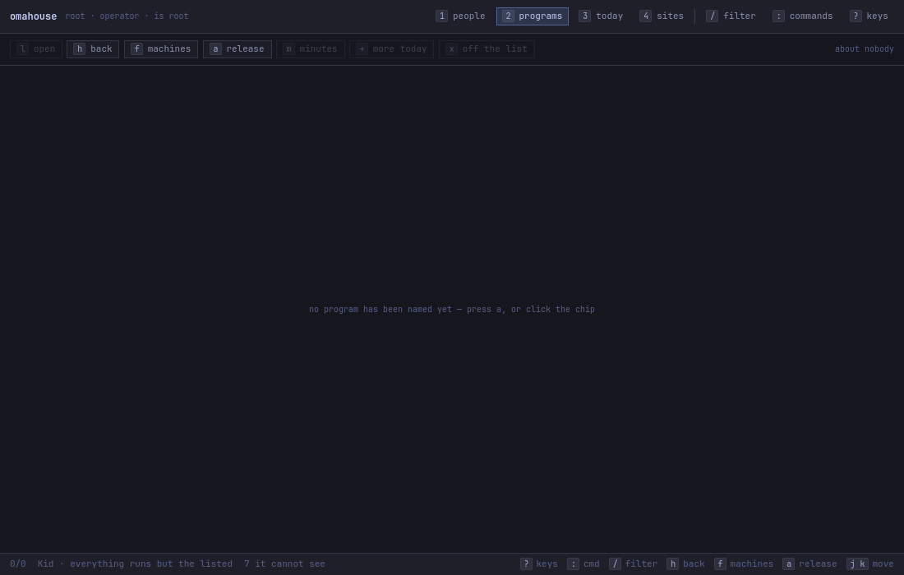

A different sentence from the empty people view, naming a different key. Four of
these exist and none of them is the same words, because each is a different
fact.

`a` opens the picker. **What is open right now comes first**, because a running
scope is the ground truth, and the installed `.desktop` entries follow. The line
under each id is what is really inside it, in the urgent colour when it
disagrees with the name:


This window will not let a rule about a shim be written without showing what the
shim holds — releasing `gtk-launch` is releasing whatever it launches next.

Choosing a row asks how long a day, and this is the one question that accepts an
empty answer:


Then polkit, and then the list has rows in it:

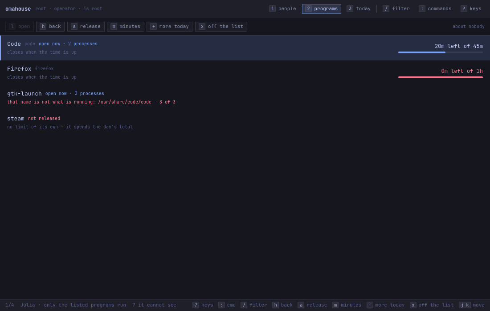

Four rows and four different things: a program running under its limit, one that
has run out (the balance and the bar in the urgent colour), one whose scope name
is a launcher shim with something else inside it, and one that is named and
refused.

# 4. Putting a clock on the day

`3`, or the **today** chip. On the same new profile:


`s` is the whole day. It opens pre-filled with what is written in the profile:


`m` is one budget's day, and it opens the same way — **with what the profile
says, not with what today's grants have made of it**. Folding a grant made for
one day into the rule for every day is the mistake that avoids:


With numbers written, the view is the balances and the day's log in one column:

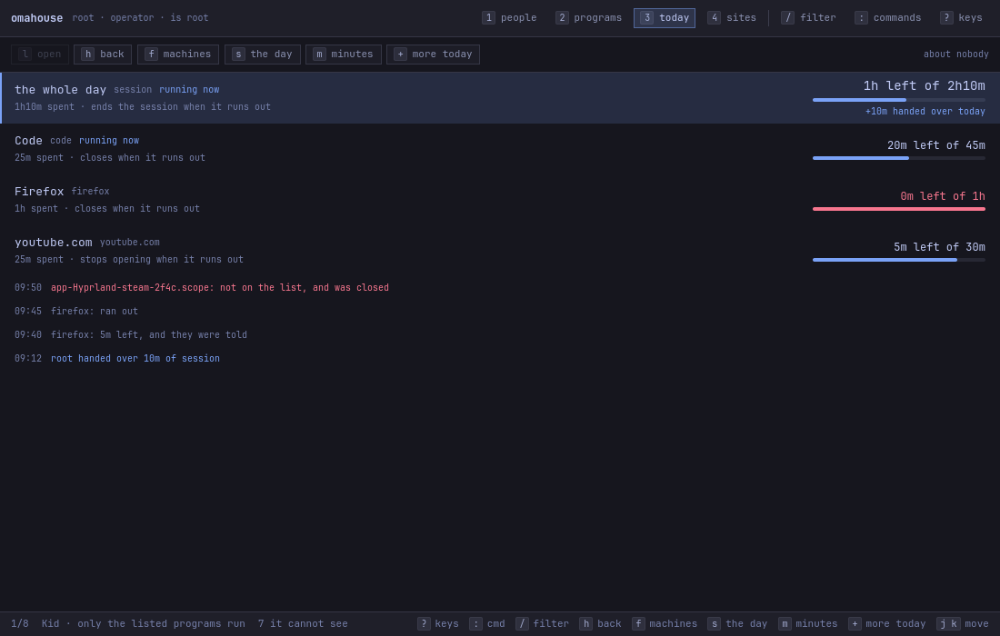

The session budget first, because it is what somebody opened this window for,
then a budget per program, then the day's log newest first: a denial in the
urgent colour, a budget running out, a warning that was delivered, and the grant
in the accent colour. It is **one list**, so `j` and `k` walk the whole of it
without a key to get into a panel.

On the computer that manages the household, **and once there is another
computer written down in `machines.json`**, every budget row carries a second
line under its own: **the house.** A manager with nobody else on its list is a
household of one, and a line adding that up would say `here` twice.
`session: 2h` is two hours in the household
and not two hours per computer — so a manager that drew only the machine it is
sitting at was showing a third of somebody's evening as the whole of it. The
line reads `the house: 1h40m spent · 30m left · here 1h10m · the kitchen laptop
30m`, which is `omahouse house` in one sentence, and it names any computer that
has sent nothing today rather than leaving it silently out of the sum.

It is not in the pictures because the household they are drawn from is one
computer, which is `machine kind: alone` and the state most households are in.
What is enforced *here* is unchanged by it: this machine goes on holding its own
number against its own ledger, and the total is a thing the window says.

A site budget is a budget and is on this list too — `youtube.com`, with *stops
opening when it runs out*, which is the fourth thing running out can do. What
changes it is `m` here as well as on the sites view, and the verb underneath is
`limit --site` rather than `limit --budget`: the CLI refuses the wrong one for a
domain rather than guessing, so the window carries which namespace an id is in
and never infers it from the shape of the string.

`+` is more time **today**. It goes into today's ledger, expires with it, and
adds to the limit rather than replacing it:

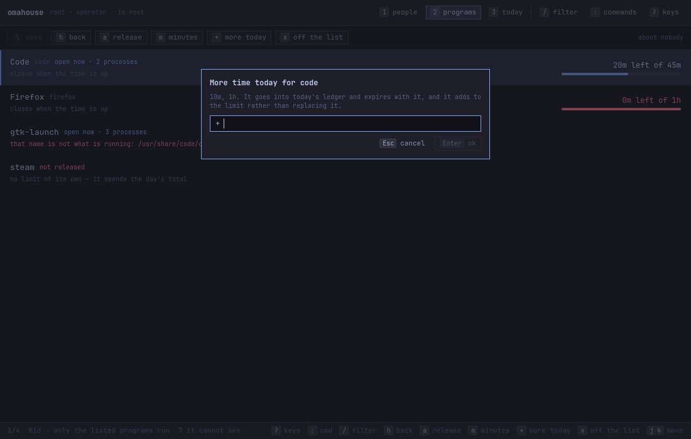

The `+` on the left is drawn by the field and is not in it.

`p` is whether the budget under the cursor comes back tomorrow. It turns an
allowance into a pot that **never resets** — two hours are two hours until
somebody hands over more, whatever the clock says and however often somebody
logs in — and turns a pot back into an allowance, through `omahouse limit
--resets`, with the number written in the profile said again unchanged. A pot's
row says `never resets` after what happens when it runs out, `m` on it asks
for *minutes in all* rather than minutes a day, and a new number keeps it a
pot: whether a budget resets is a decision somebody made once, like what it
does when it runs out. It is on the today view only, because that is the one
list every budget is on, and only on a row with a number, since a budget with
no limit has nothing for the turn of the date to empty.

# 5. Saying which sites open

`4`, or the **sites** chip. **A view of its own rather than rows folded into the
programs**, and the reason is the same one the CLI gives for having `web block`
beside `deny`: taking a program off somebody's list and changing what every
browser on the machine will open are different enough acts that they should not
be one word — and here they cannot be one list either, because not one command
on the row is shared. `x` on a program writes `omahouse deny`; the nearest thing
on a site is `omahouse web allow`, which is not a removal at all.

On a profile with nothing said about sites:


**The two lines above the list stay on the empty view on purpose**: somebody
about to block their first site should read what a browser policy reaches
*before* pressing `b`, not after.

`b` asks for a domain, and refuses an address with the CLI's own words:

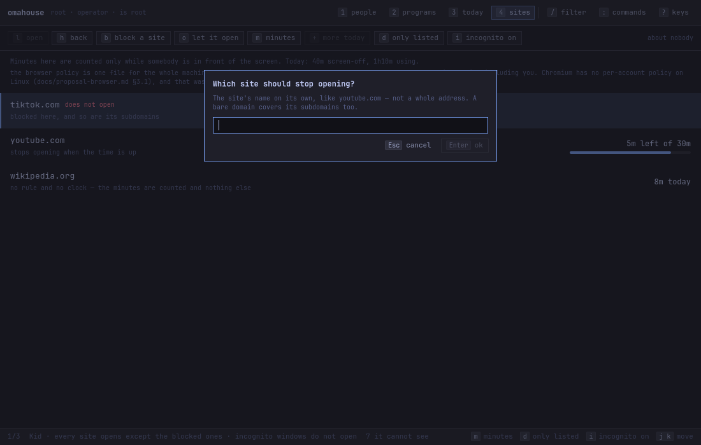

Chromium's filter format would accept most addresses and mean something slightly
different by each, and an operator who typed an address and got a rule about its
host would not find out until the day it did not fire. The field opens empty
here because the row under the cursor is already blocked; on a row that is not,
it opens with that row's domain in it.

`m` is minutes a day on a site, and it says two things that are not said about a
program:

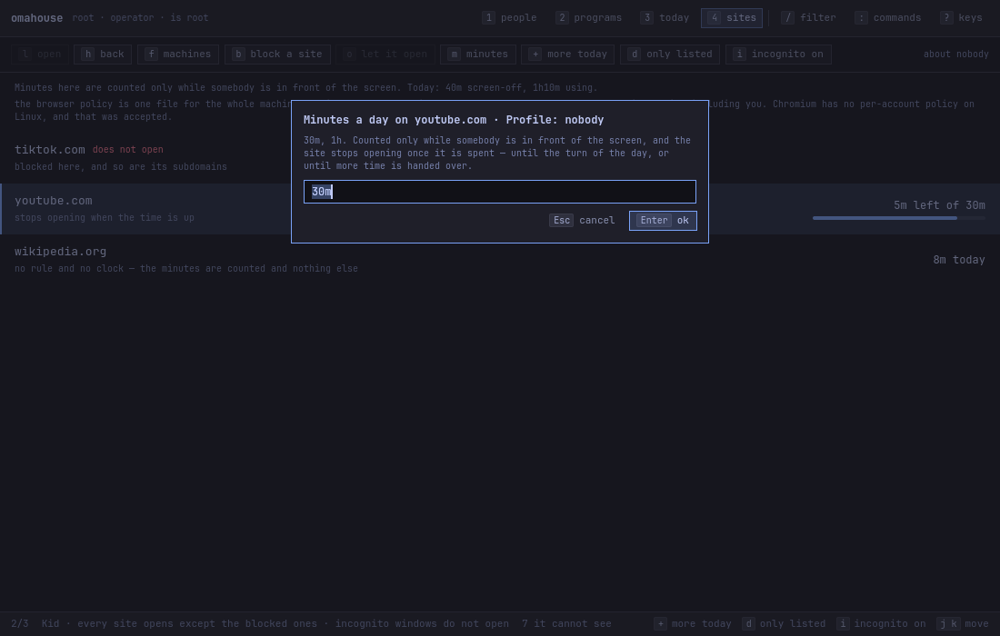

The minutes are crossed with presence, and what running out does is stop the
site opening rather than close anything. Both come back on their own — nothing
remembers a blocked site, and the turn of the day, a grant and `enforce --off`
each let it through again with no verb having to know the browser's policy file
exists.

The view itself:

![The sites view: a line reading "Minutes here are counted only while somebody is in front of the screen. Today: 40m screen-off, 1h10m using.", under it the reach of a browser policy, then three rows — tiktok.com "does not open" in red with "blocked here, and so are its subdomains"; youtube.com "stops opening when the time is up" and "5m left of 30m" over a bar; wikipedia.org "no rule and no clock — the minutes are counted and nothing else" and "8m today". The chip bar reads open, back, block a site, let it open, minutes, more today, only listed, incognito on.](img/15-operator-sites.png)

Three rows and three different things: a site named and blocked, a site with a
clock on it and five minutes left, and a site with no rule and no clock that the
day counted minutes against anyway. The third is why this view is worth opening
on a profile with no web rules at all — it is the afternoon's browsing, which
had no screen in this window before.

Two lines sit above the list and are about the whole view rather than any row,
so `j` cannot walk past them and `/` cannot filter them away:

**Presence, where it explains something.** An app is billed for running, screen
or no screen — [`design.md` §5.1](design.md) decided that and this window must
not imply otherwise — but a site is billed only where the browser and the screen
agree. So `25m` on YouTube in an afternoon somebody remembers as longer is
answered on the line above it, by the `40m screen-off`. It is read out of the
day's ledger and never measured here.

**The reach, once.** The browser policy is one file for the whole machine, the
operator's own account included. `omahouse web` says this when it writes and
`omahouse status` says it when it prints; this is the window's one place, out of
the same function in `src/core/WebPolicy.h`, so the three cannot come to say it
differently. The sheets that open over this view deliberately do not repeat it —
a tool that re-argues a settled decision every time it is used is a tool people
stop reading.

The status bar carries the two facts that are about the profile and not about a
row: whether only the listed sites open, and what was said about incognito —
which is a three-state, because *nothing said* is not the same as *allowed*.

# 6. Taking something back

Two things ask before they happen, and nothing else does. A confirmation on an
action that is its own undo is a keystroke charged for nothing.

`x` on a released program:

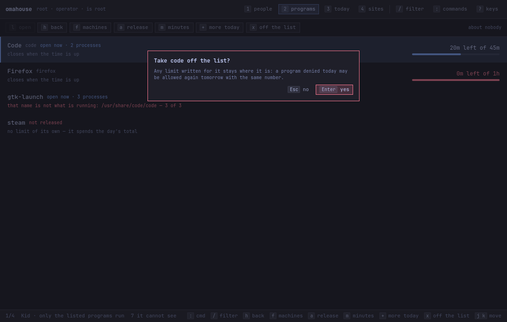

`x` on the people view:

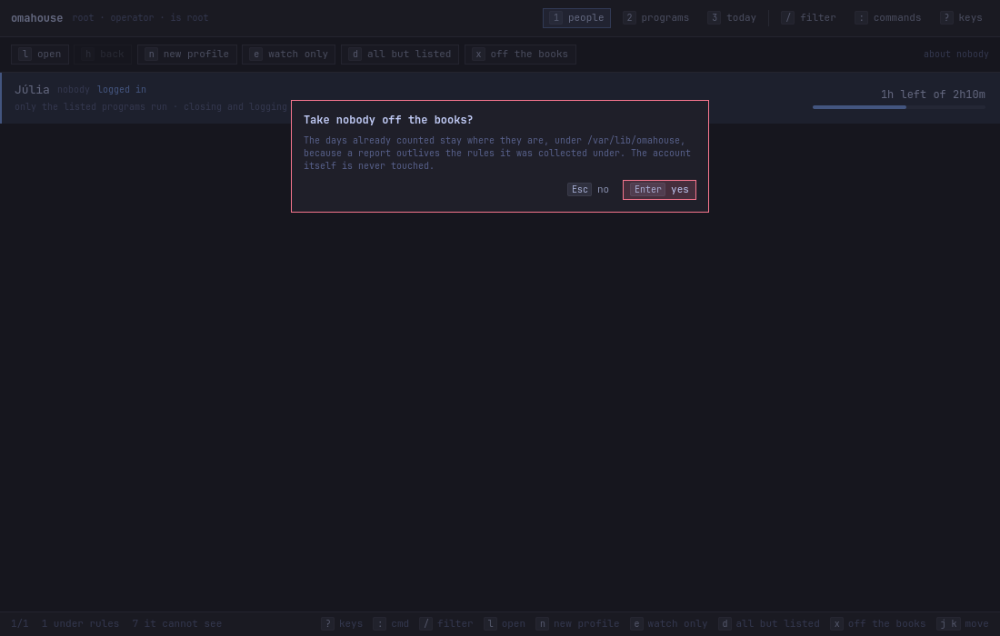

# 7. Finding your way around

`?` is every key this window answers, on the window. Any key closes it:


The bottom group is generated from the same table the chips are drawn from, so
it changes with the view and cannot promise a key nothing answers.

`:` is everything the window can do **right now**, by name, with its key beside
it:


Only what is usable is listed: a menu of things that would refuse is a menu you
stop reading. The same palette over the sites view is where the six site
commands are read by name, which is the visible half of the promise that nothing
arrived on only one of the two doors:

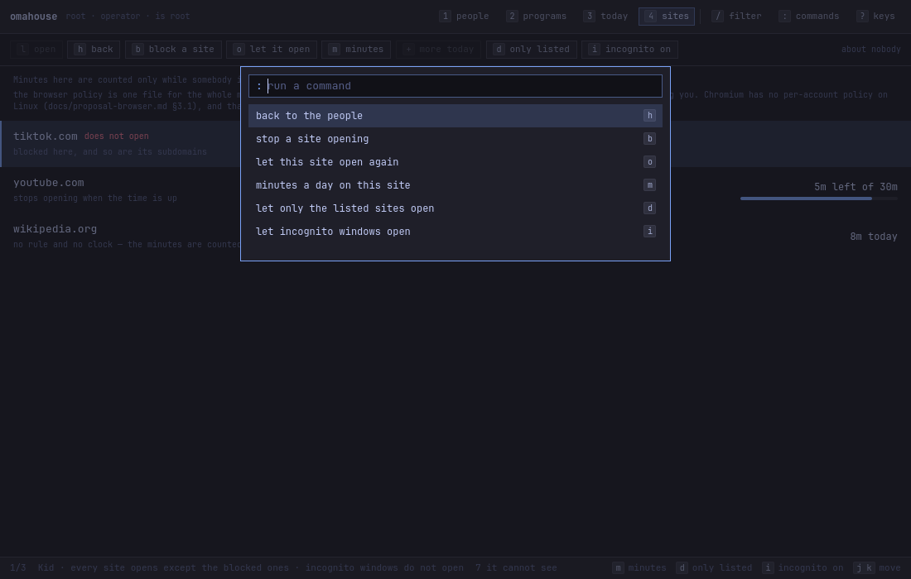

**more time today** is missing from that list, and that is the point of listing
only what is usable: the cursor is on `tiktok.com`, which has no clock, and
there is nothing to hand more of.

`/` narrows the list it is typed on, and no other; `Enter` keeps it, `Esc`
clears it:

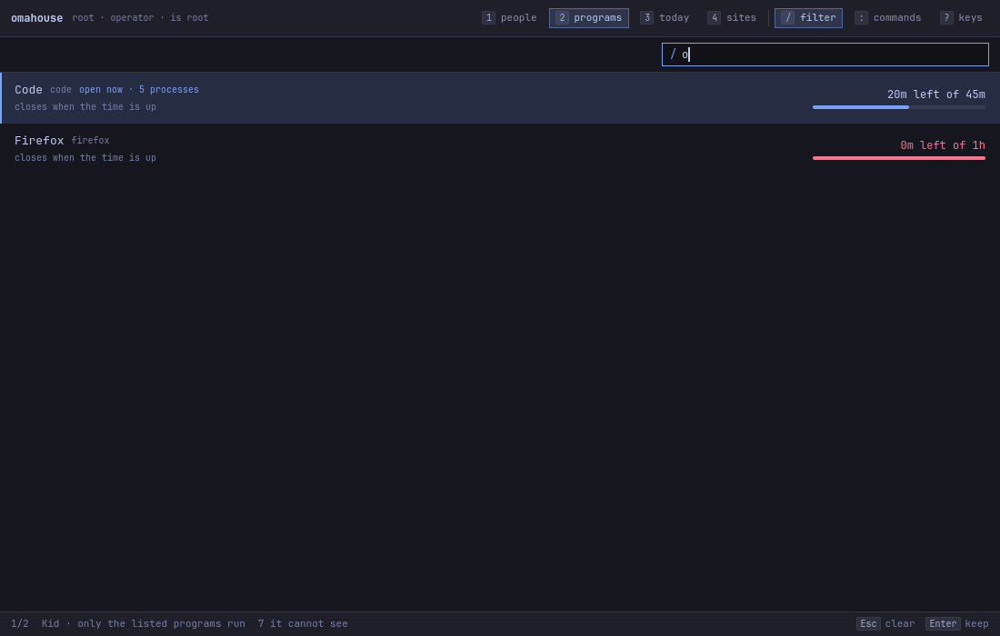

**One needle per list, and each keeps its own.** The people list is what the
window's subject follows, so a shared needle that missed the person emptied it
and left the programs view with nobody to be about. Going to another view and
back finds the list as it was left, and the status bar always shows the needle
belonging to what is on screen — so nothing is ever narrowed by something
invisible.

# 8. The same window, from the other side

Everybody who is not in `wheel`: the same window, the same rows, the same keys
to walk them, and nothing to press. **It is not a second window** — a read-only
window built out of a second set of components would be a second window to keep
in step.

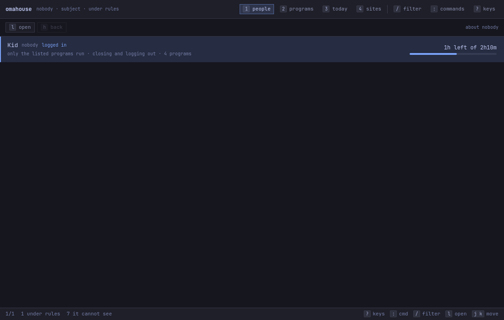

One row, their own. The rest of the household is not shown here — the file is
world readable, but a window is not a reason to publish it.

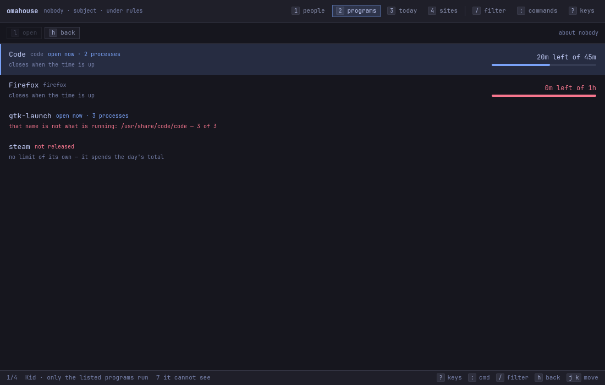

The same information, including the red shim warning. What is missing is every
way to change it.

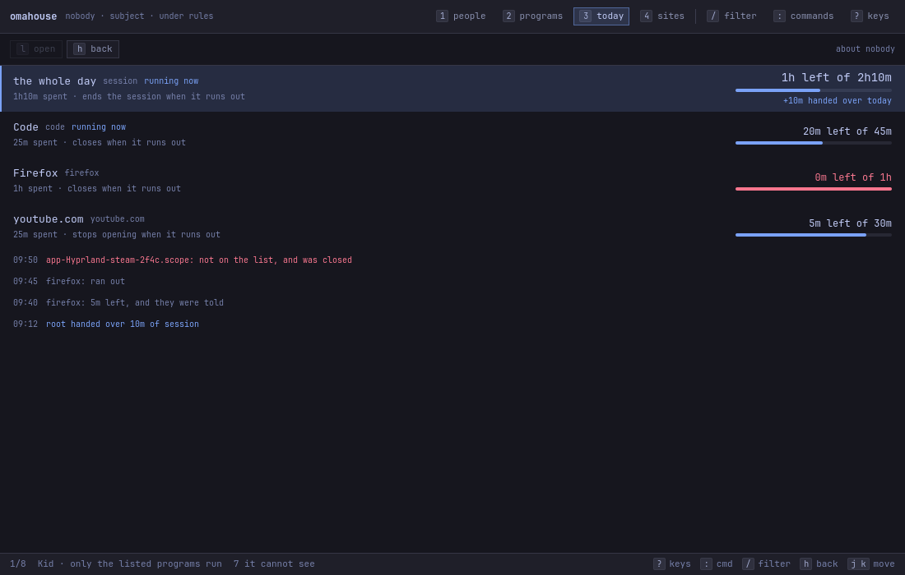

This is the screen [`design.md` §8](design.md) is about: the fiscalised account
is shown what is left, and the decisions are somebody else's.

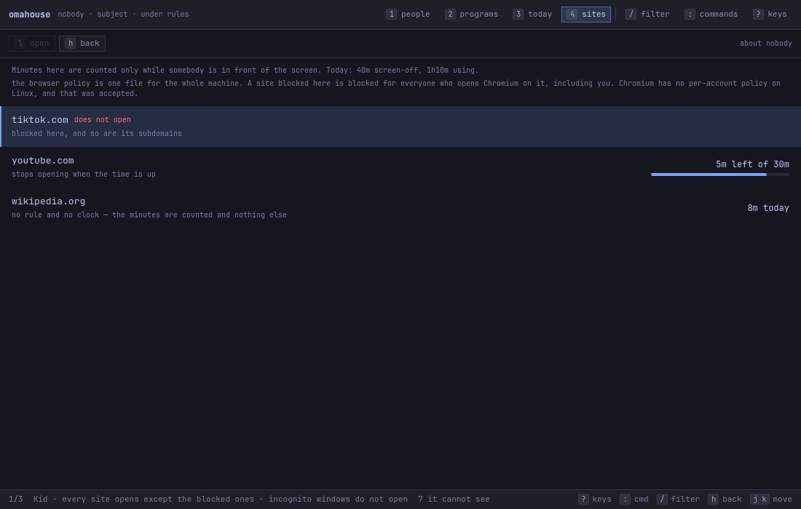

The same rows and the same two lines above them, which is deliberate on this
face more than on the other one. This is the screen that answers *why will this
site not open* and *where did the half hour go*, and both answers are on it: the
rule, the clock, and the `40m screen-off` that explains why the number is
smaller than the afternoon felt. The reach is here too, because a site somebody
else blocked is blocked in this account's browser as well as in theirs, and
being overruled without being told is the one thing that would make the rule
dishonest.

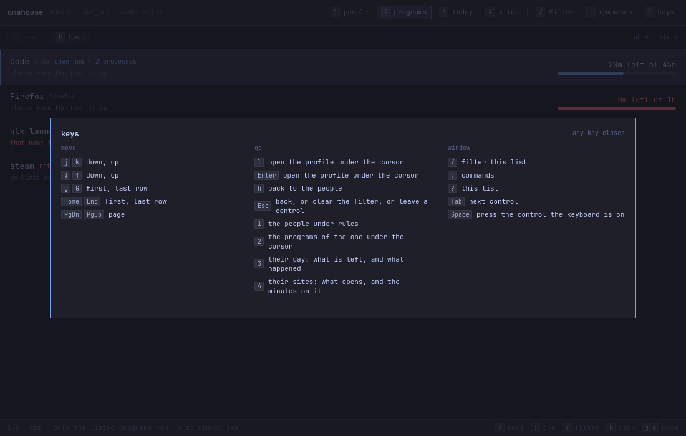

Three groups instead of four. There is no fourth because there is nothing in it.

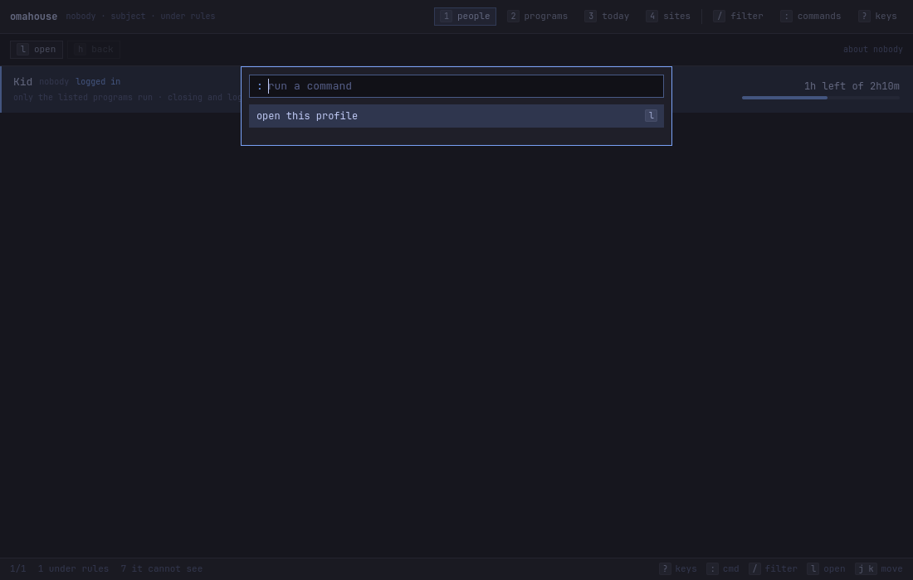

And on an account nobody has put under rules:

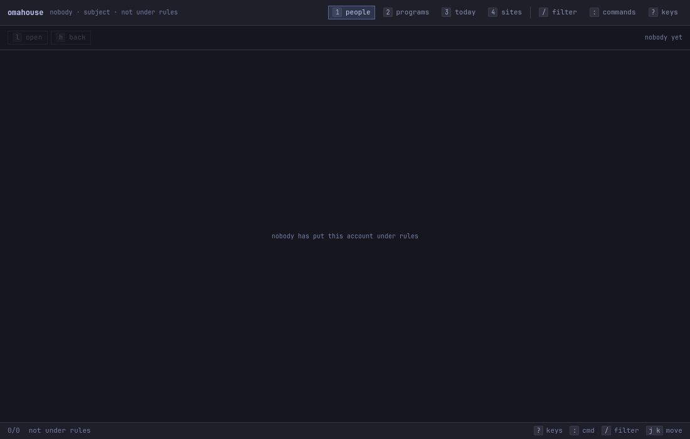

A different sentence from the operator's empty list, because it is a different
fact and there is nothing this reader could press about it.

# 9. What has no screen

Four things belong on this walk by their absence, because somebody looking for
them should find out that there is nothing to find.

**How many times a blocked site was tried.** There is no such number and there
cannot be one. A managed policy blocks inside Chromium and reports nothing out —
[`design.md` §11](design.md) says so plainly — so omahouse never learns the
attempt happened at all. A row reading *tried 4 times* would be the window
making one up, and the same absence is why a blocked site has no message from
the operator on it either: the browser's own page names nobody and explains
nothing.

**Which site is in the front tab right now.** `omahouse status` prints this and
says whether it is being counted; the window does not. The browser's host writes
it to `/run/user/<uid>/omahouse/focus`, 0600 in the fiscalised account's own
runtime directory, and the studio is neither that account nor root. So the sites
view says what the day counted and no row says *open now*, where a program row
does — and the today view never marks a site budget *running now* either,
because answering that from the app scopes would be a name that matched by
coincidence rather than a browser.

**polkit.** Every write this window makes goes out as `pkexec omahouse`, and on
a real machine that raises a password dialogue and can come back with *cancelled
at the password prompt* or *polkit would not authorise it* on the status bar.
None of that can be generated: the fixture writes into a temporary tree, where
nothing is elevated, and a generator that raised a real polkit prompt would be a
documentation task asking a human for a password. It is `31` and `37` in the
live set below, and the sentence that follows it is `32`.

**A scope nothing can name.** `omahouse status` reports these prominently — a
`tmux-spawn-<uuid>.scope` with twenty processes in it is somebody at the
keyboard. The example household has one, with four processes in it. It appears
nowhere in this window: `House` computes `unnamedProcesses` for every profile
and no view reads it. What the status bar does say is the other number, `7 it
cannot see`, which is the processes in `session.slice` — a different fact, and
not this one. It is
[defect 4](what-does-not-work.md#4-a-scope-nothing-can-name-has-no-screen-in-the-window).

---

# 10. The same window on a live machine, and the screens that are not ours

One run through a VM with Omarchy installed on it, on **2026-09-04, between
08:29 and 08:54**, driven by `ydotool` and captured by `virsh screenshot` and by
`grim`. Forty-three frames. Four more were added on the same machine between
18:58 and 19:01 for the web rules — the whole cycle of installing the package,
blocking a site, and removing the package again — and three more on 2026-09-04
at 21:26 and after, for the browser meter and for the machine being put back.

The account under rules on that machine was called `kid`, and the name is
drawn into the pictures. Everywhere else in this repository the example account
is `kid`, which stands for whatever the account is called on the machine you are
reading this on.

**These are not regenerable, and they are not in the generator on purpose.**
Most of the screens below belong to something other than this window — a display
manager, a notification daemon, a lock screen, polkit, a compositor, a browser —
and a generator that faked one would be publishing a picture of a thing that had
not happened.

| the screen | who draws it | in `../vm/shots/` |
|---|---|---|
| the greeter | SDDM | `01`, `02`, `17`, `26` |
| the greeter refusing a blocked account — the box goes red and says nothing | SDDM and `pam_listfile` | `18` |
| a warning, a last word before closing, a denial | the notification daemon | `08`, `10`, `11`, `13`, `14` |
| the Omarchy application menu, and a launch that was refused | walker / the compositor | `06`, `07`, `09` |
| the lock screen the session's last warnings went out behind | `hyprlock` | `15` |
| the black screen after `loginctl terminate-user` | nothing at all | `16` |
| the polkit password dialogue over the studio | polkit's agent | `31`, `37` |
| a session standing up, a program closing under it | the compositor | `03`, `04`, `05`, `12`, `19`, `27` |
| a site refused by the managed policy, and the same site opening once the package is gone | Chromium | `44`, `46` |
| **Nova janela anônima** greyed out in Chromium's own menu, and back a minute later | Chromium | `45`, `47` |
| the browser meter's own sites, in front of a real screen | Chromium | `48`, `49` |
| the machine put back the way the run found it | the harness | `50` |

And these are the studio itself, in a real session — the same screens as above
with the machine's real theme, a real `.desktop` catalogue and a real day behind
them. Worth keeping beside the generated set for exactly that reason, and worth
not mistaking for it:

| the screen | in `../vm/shots/` |
|---|---|
| the three views and the key sheet, subject face, as `kid` | `20`–`24` |
| the command palette, subject face | `25` |
| the three views and the key sheet, operator face, as `howl` | `28`, `29`, `33`, `41` |
| the new-profile prompt and the refusal that followed it | `30`, `32` |
| the program picker, filtered, over a real catalogue of shims | `34`, `35` |
| the limit, the grant and the day's total, asked and answered | `36`, `38`, `39`, `40`, `42`, `43` |

## Household machines

Press **f** as the operator to list household machines, even without selecting
an account. With a person selected, each machine also shows that draft's publication
standing; profiles without budgets still show their machines. Each budget row is one limited
budget on one computer: that computer's consumption, the household's credit and
what is left of it, followed by the observation state and timestamp.

**This computer's own row is worked out the way the today view works it out**,
and not from the two household numbers beside it. Time handed over here with
`grant` is in neither of them until the manager next plans, so a panel that read
only those would say one figure for what is left and the today view another,
about the same computer, on the same screen. Every other row is the household's
view, because that is all this machine knows about them — a grant made in the
bedroom is in nothing here until that computer reports, and the timestamp at the
end of the row is what says how old that is. **/**
filters these rows, **j/k** moves, **+** records household credit, and **h**
returns to people. The same commands are clickable; the subject face cannot
enter this view.

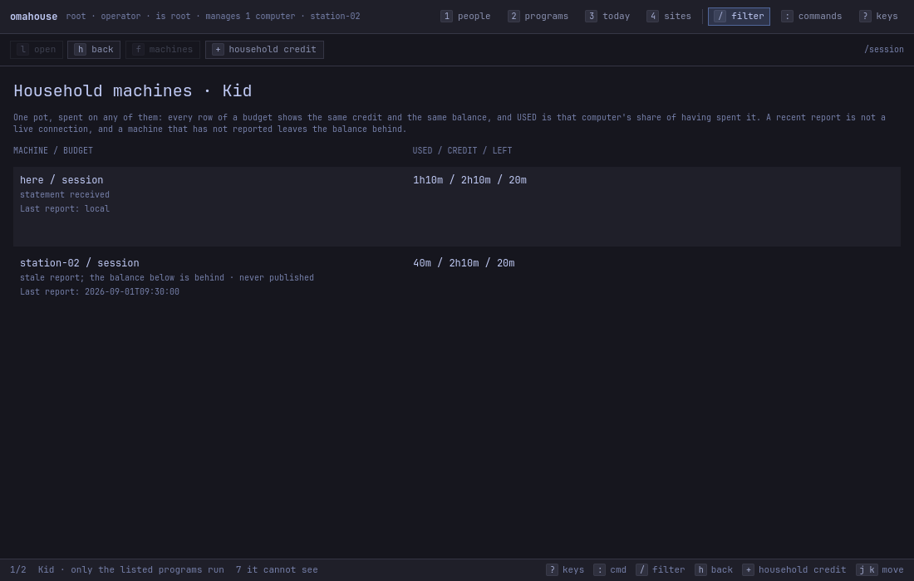

The generated fixture has a household credit of 2h10m against 1h10m spent here
and 40m on station-02, so **both rows read 20m left** — there is one pot and no
quota per machine, and what differs down the column is `USED`. The remote
observation has a fixed old timestamp, so that 20m may already have been spent
over there and the row says so.

Credit added here is delivered by the next successful Battery cycle. The window
reads local snapshots and uses the existing privileged CLI for writes; it does
not run a scheduler. Follow [the explicit setup](how-to-schedule-household.md)
to enroll computers and activate the Omakure schedule.

The header names this computer's role: a manager shows how many computers it
manages and their names; a managed computer says it is managed from another
computer. The sentence elides before it can overlap the view tabs.

## Publishing a draft

On the manager's people view, **u publish** opens a selection sheet. Computers
behind or never published start selected; up-to-date computers start unselected.
Space toggles a row and Enter publishes the chosen destinations through one CLI
call. Empty selection and Escape before submission change nothing. During the
operation Escape hides the sheet; it does not cancel an in-flight publication.
The result shows every nonempty output line from the CLI.

An unresolved profile disables publication and names the computer whose version
needs a merge decision. The people row says `unpublished`, `1 behind`, or
`unresolved · changed on …`. Not-paired and changed-there rows cannot be selected.

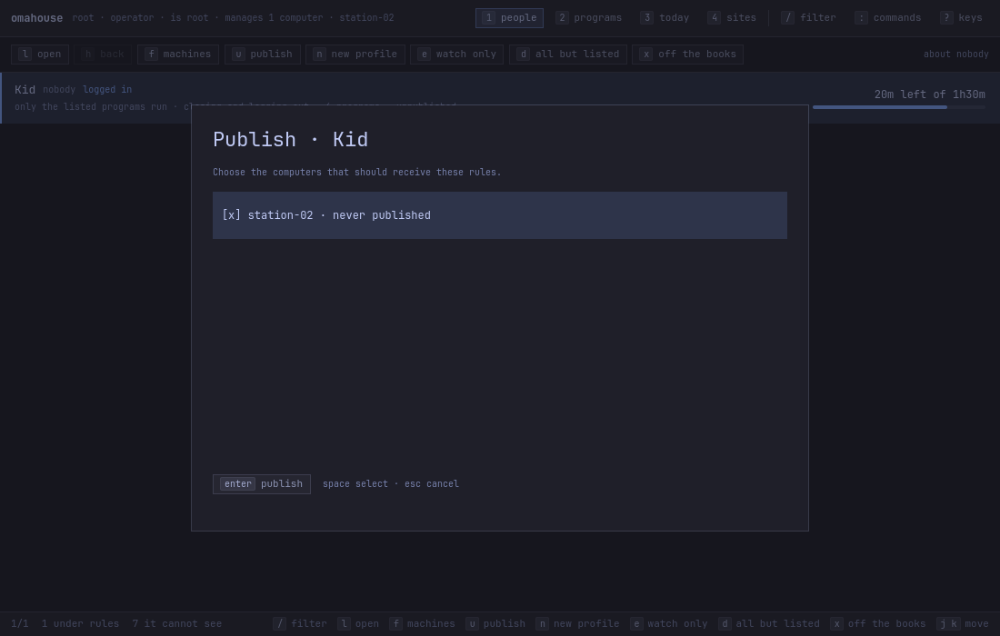

## Choosing who a new rule is for

Adding a program, blocking a site or setting a limit opens an explicit profile
selector, even when there is only one profile. Click the account or filter it
and press Enter. Escape leaves the rules unchanged. The program picker and
following form keep the chosen account visible; refreshing the people list
cannot redirect a submitted rule.

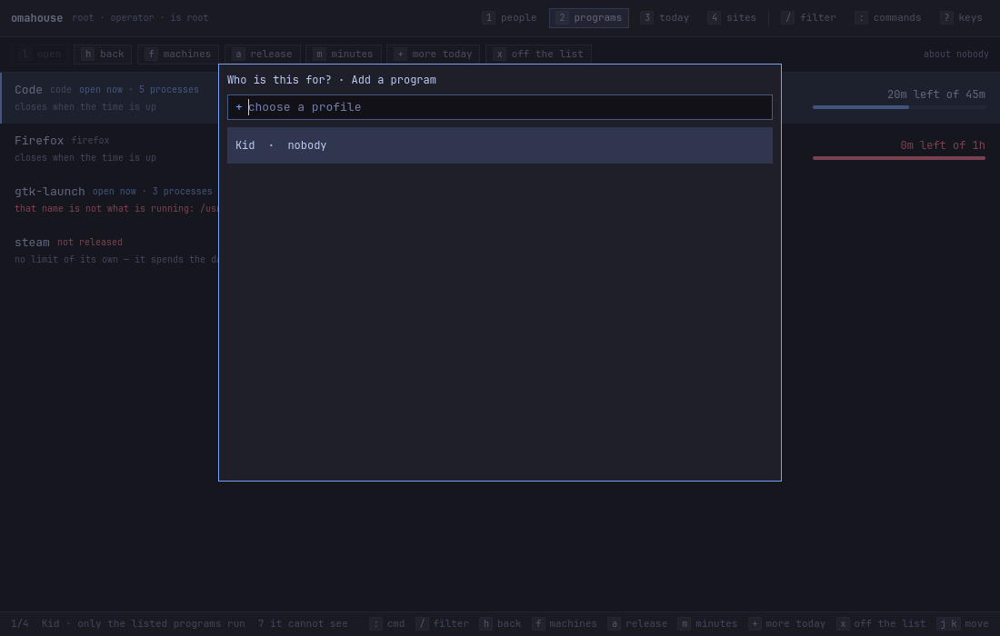
